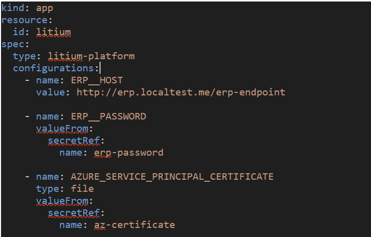

For app configuration management, it is advisable to utilize configuration properties. These properties are specified within the manifest YAML file. Values can be directly included as plain text in the YAML file. However, for secret or environment-specific values, they should be securely stored as secrets in the Serverless Cloud. These secret values can then be referenced in the YAML file.

One common requirement is to have distinct environment variables for the same application across different environments. In Litium Serverless Cloud, this is achieved by setting up these values as [secrets](#secrets). Once created, these secrets are then referenced directly in your [manifest file](#configuration). This approach ensures both seamless environment-specific configuration and enhanced security for your application settings.

## Secrets

To effectively manage different configuration values in various environments, the use of secrets is crucial. This method is particularly important when you need distinct environment variables for each environment. Additionally, secrets are essential for maintaining the confidentiality of sensitive configuration values. Essentially, secrets serve a dual purpose: they enable distinct environment-specific configurations and ensure the security of confidential data.

### Create

A secret can be added as a text value, a binary file or text file. The id of the secret (--secret) will be used in the configuration in the yaml-file to reference the secret.

**Examples:**

To create a secret for the enviroment "staging" within the subscription "my-subscription" with a text value with the id of the secret set to "erp-password" you would execute this command:

```powershell
litium-cloud environment secret create --secret erp-password --value "staging-password" --subscription my-subscription --environment staging
```

To use another password for the "production" environment you would create another secret for the "production" environment with the same id:

```powershell
litium-cloud environment secret create --secret erp-password --value "production-password" --subscription my-subscription --environment production
```

To create a secret within the subscription "my-subscription" with a value from a text file with the id "az-certificate" you would execute this command:

```powershell
litium-cloud subscription secret create --secret az-certificate --text-value .\my-text-file.cert --subscription my-subscription
```

To create a secret within the subscription "my-subscription" with a value from a binary file with the id "binary-file" you would execute this command:

```powershell
litium-cloud subscription secret create --secret binary-file --binary-value .\my-binary.bin --subscription my-subscription
```

### View secrets

To list secrets you use the "secret list" command within either the environment or subscription. The list command for environment will also display secrets from the subscription. To view the value use use the "secret value --secret id-of-secret" command.

## App resource configuration

To define configurations value to use within your app you add a name and value beneath the "configurations" section in your yaml-file. Values may be set in plain text or referenced by a secret. 

If the data is sensitive and/or if you want to have different values in different environments you should use secrets. Below is an example of how to add different configuration values (1) plain text, (2) reference a secret value and (3) reference a secret file. Note that the secret needs to be created in the environment or subscription where the manifest yaml-file is being applied before the apply command is executed.



The type can be set to environment or file. If omitted the environment type will be used.  

Name need to be uppercase letters, from the portable character set, [Character Set (opengroup.org)](https://pubs.opengroup.org/onlinepubs/000095399/basedefs/xbd_chap06.html#tagtcjh_3), digits and underscore, when type is file; dot is included as well. Names need to start with a letter. Naming set to be in line with [Environment Variables (opengroup.org)](https://pubs.opengroup.org/onlinepubs/000095399/basedefs/xbd_chap08.html) specification. 

If type is specified as environment, the name will be used to create an environment variable with the value. Name will be converter to uppercase letters.  

If type is specified as file, the name will be used to create a file with the value in folder /app\_secrets, all file names will be converted to lowercase letters. 

If value is specified, the value will be used for the environment variable or file content. 

If valueFrom is specified, the referenced data is fetched into the environment variable or file. 

**Apply changes**

To apply changes made in your yaml-file you use the apply-command.

### Access from appsettings.json

You can with the configuration variable **ASPNETCORE\_ENVIRONMENT** set the type of environment that should be used. This have the affect that also **appsettings.\[EnvironmentName\].json** will be loaded. 

**Important! Setting environment as "Development" will not work and will prevent the app to start.**

Environment variables names reflects the structure of an appsettings.json. Each element in the hierarchy is separated by a double underscore. For instance, the example above where we have specified a name like "ERP\_\_HOST" and "ERP\_\_PASSWORD" is equialent to the below value in appsettings.json:

```powershell
{ 
  "ERP": {
    "PASSWORD": "VALUE",
    "HOST": "VALUE"
  }
}
```

and can be accessed as normal from configuration, e.g. \_configuration.GetSection("ERP:HOST").Value

Mor examples from [Microsoft docs](https://learn.microsoft.com/en-us/aspnet/core/fundamentals/configuration/?view=aspnetcore-8.0#naming-of-environment-variables).
