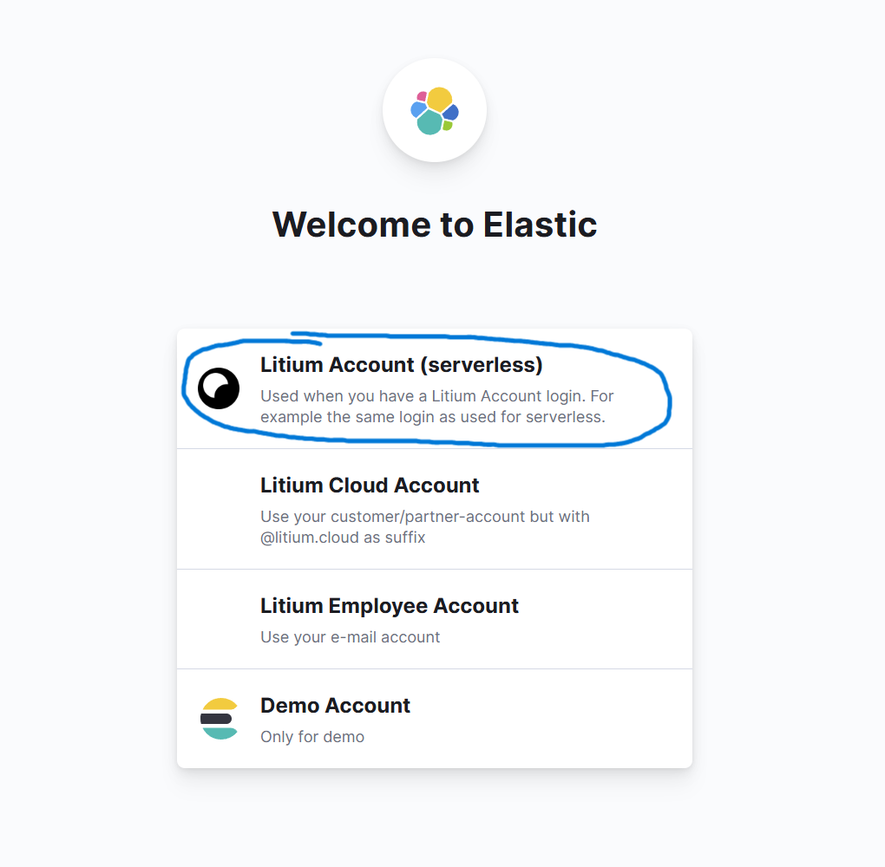
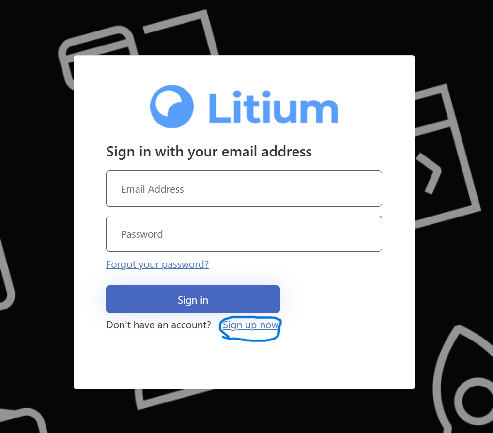
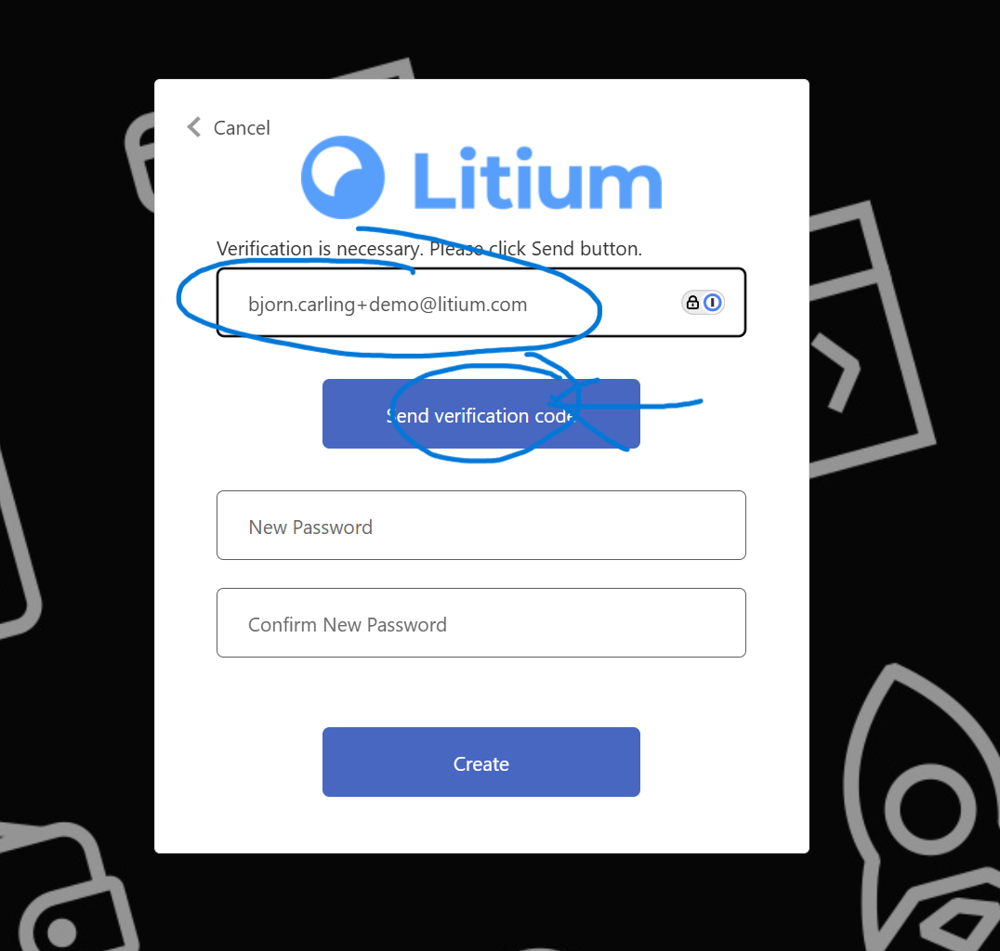
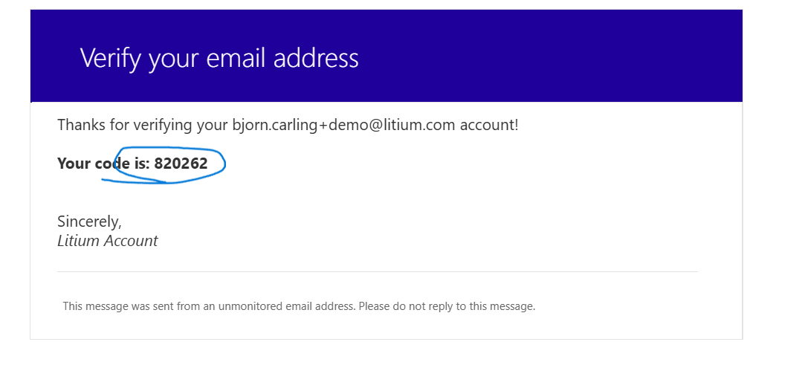
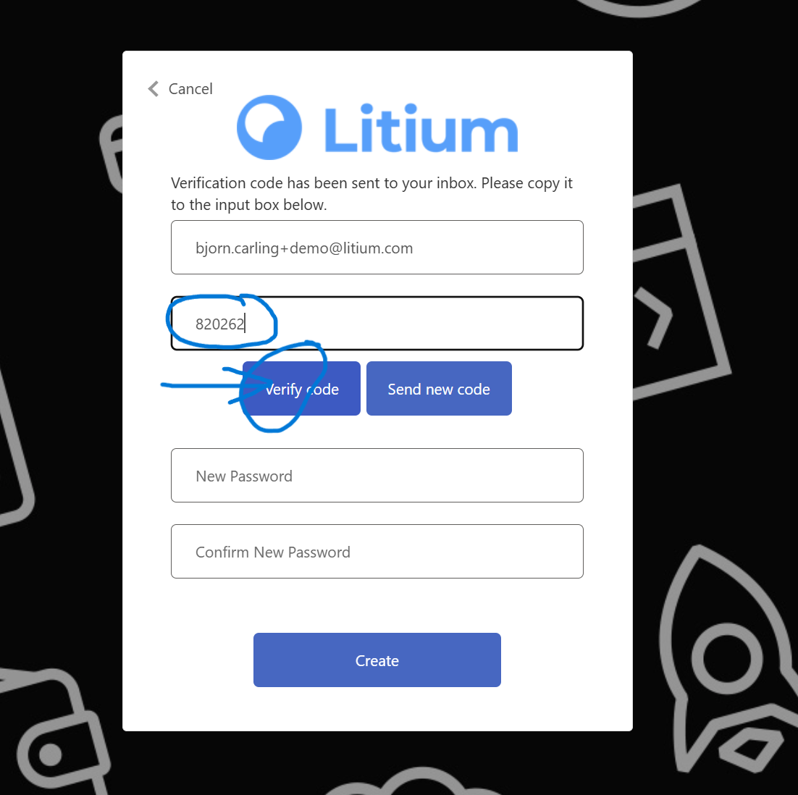
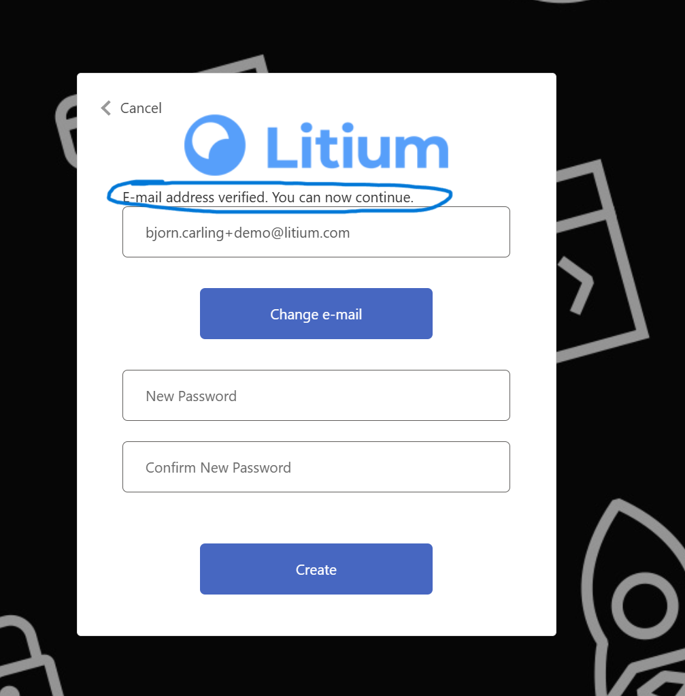
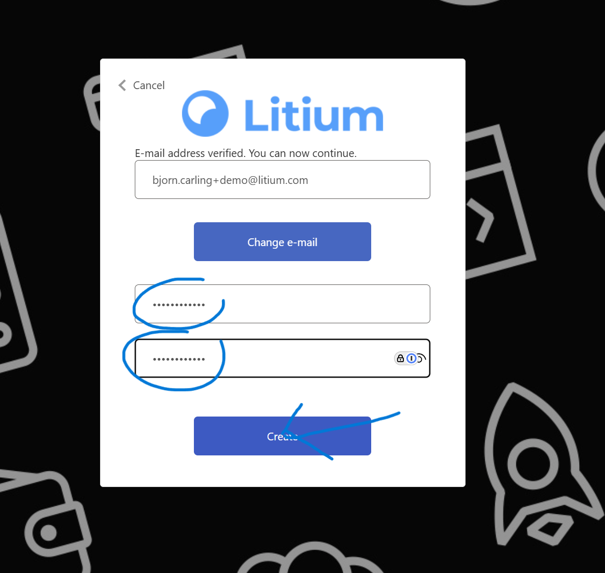
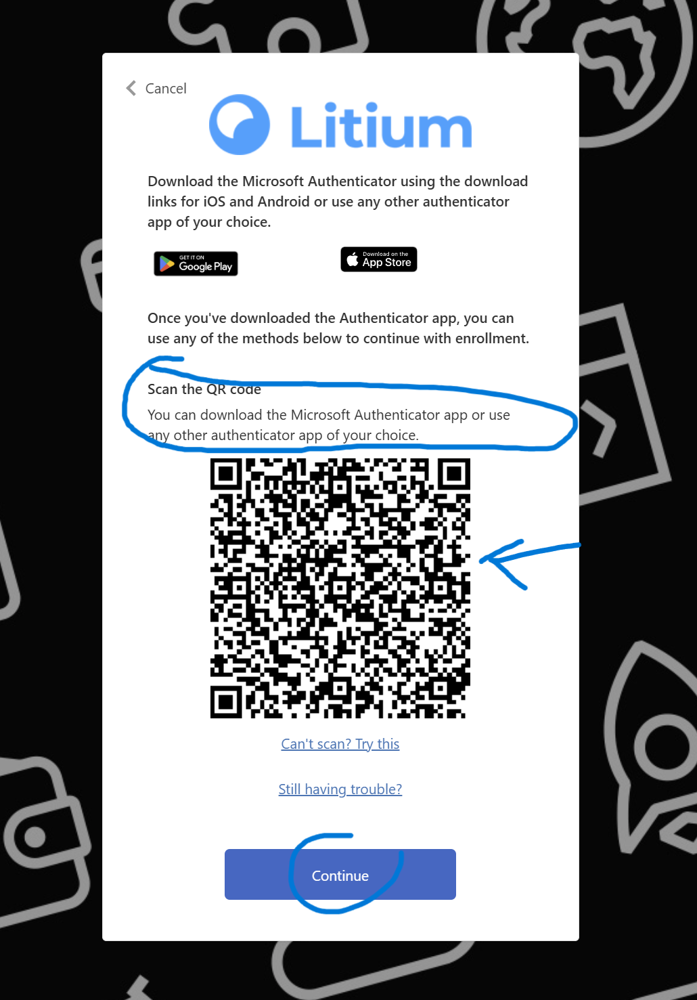
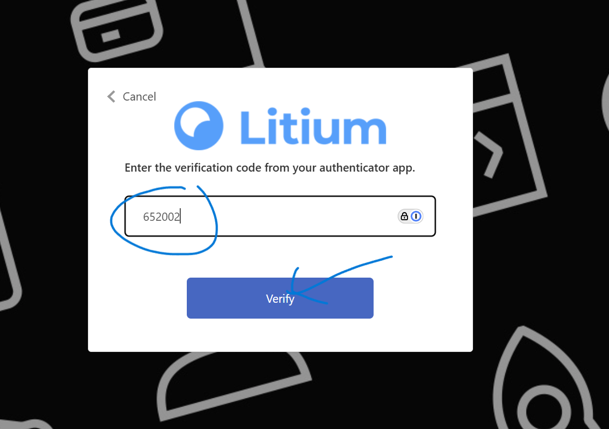
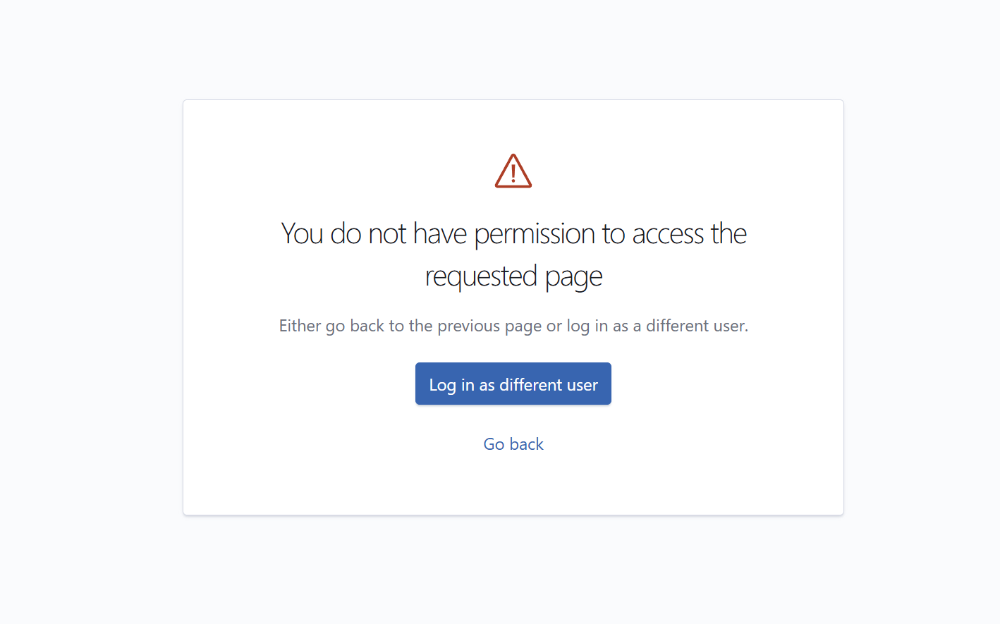

Serverless Cloud and Litium Insights for Serverless Cloud uses accounts in Litium Account to authenticate and login. Note - this is not the same as the docs-account, so if you haven't logged into Serverless Cloud or Litium Insights for subscriptions in Serverless Cloud before you most likely don't have an account and need to create one.  
  
Having a Litium Account is needed to be able to login to Serverless Cloud CLI and to view logs and BI data for Litium Insights for subscriptions in Serverless Cloud. 

## Permissions

**Important** - to be able to view subscriptions and/or login and view logs and BI-data in Litium Insights you also need the correct permissions setup. Do this **before** you create your account do avoid error messages like unauthorized.

**Subscriptions** \- When a subscription is created Litium Support will give access to the subscription. Then the partner will themselves manage access to additional users. [Read more about access to subscriptions](/cloud/serverless/access).

**Litium Insights** - To give a user permission to Litium insights (logs and/or BI-data) [read more about which access that should be assigned](/cloud/serverless/public-apps-litium-insights). **Important** \- access should be added before the user signs up and try to login

## Create account

1.  You start the create account flow by either using the CLI authorizing with command litium-cloud auth login (that will open a browser) or by choosing to login with "Litium Account (Serverless)" on the [Litium Insights login page](https://insights.litium.cloud/). Example from Insights  
      
     
2.  Choose "Sign up now" at the bottom of the next dialog  
      
     
3.  At the next screen, enter your e-mail address and click "Send verification code"  
      
     
4.  Check your inbox for an email similar to below, find and copy code  
      
     
5.  Paste the code and click "Verify code"  
      
     
6.  Above email address it now should state "E-mail address verified. You can now continue."  
      
     
7.  Choose a password and click "Create"  
      
     
8.  Setup 2f authentication by scanning the QR code by authenticator app of your choice  
      
     
9.  On the next screen, verify your authenticator setup by entering your code from your authenticator app anc click "Verify"  
      
     
10.  All set - you now have your Litium Account

## Troubleshooting

- Can't log in to Litium Insights - getting "You do not have permission..." error - this means that your account doesnt have permissions setup for any subscription in Litium Serverless Cloud. Fix by adding access according to specifications for the [Insights app](/cloud/serverless/public-apps-litium-insights) or talk to your partner for them to give you access.  
      
    
