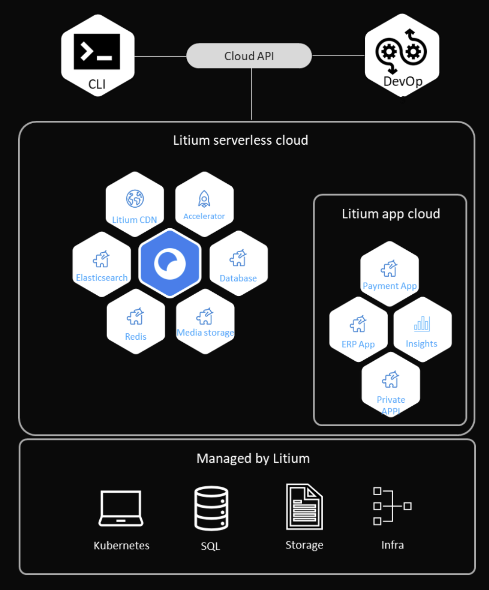

Serverless Cloud is our most performant and secure hosting infrastructure ever. Including autoscaling and a full service environment. All new customers will get access to Serverless Cloud from start. Existing customers are being granted access on an ongoing basis.

## Main advantages with Serverless Cloud

- Creating environments and installing apps are completed in minutes
- [Litium CDN](/cloud/serverless/install-litium-cdn) default for all external traffic, enhancing performance and security
- App Cloud with [private apps](/cloud/serverless/private-apps) enabling you to host and connect your private apps like .NET web, MS SQL Db, Redis Cache and more in Serverless Cloud. Installing and deploying with ease.
- [Litium Insight](/cloud/serverless/install-litium-insights) - logs are automatically being sent to Litium Insight, regardless if it's your Litium Platform, a payment app or your private app.
- Login with your own email address both to Serverless cloud, Litium Insights and more, powered by Litium Account.
- [Access control](/cloud/serverless/access-access-control). Control who has access to what with different roles. Setup [groups](/cloud/serverless/access-group) to make access control even more convenient.
- [Automated deployments](/cloud/serverless/automated-deployments). With the CLI and service principals it's easy to automate deployments.
- Automated scaling. Serverless cloud enables automatic scaling, meaning that apps automatically scales based on resource usage.
- Full self service - e.g. download storage and database backups, create and delete apps etc
- Automatic upgrades of database when updating between L8 versions.
- Background jobs are executed in it's own dedicated [worker node](/cloud/serverless/public-apps-litium-platform-worker), at no extra cost

## Getting access

New customers will get access to Serverless Cloud from start. Existing customers are being granted access on an ongoing basis, if you haven't yet got access and would like to speed up the process, please reach out to our [support team](/resources/support).

## Learn more & Getting started

Start by digging into the [Getting started documentation](/cloud/serverless/get-started) where you can read all about the basics and dig even deeper into the advantagees meantioned above.

## High level architecture

Serverless Cloud is manged through a CLI, with possibilities to authenticate with a service principal that enables automated devops deployments. In Serverless Cloud you can create environments and apps. Both public apps, e.g. Litium platform (including database, elastic search, redis etc). But also private apps that are unique for each project, e.g. .NET web and private MS SQL database. Litium is managing and monitoring the infrastructure stack for you. See below image for an overview.

