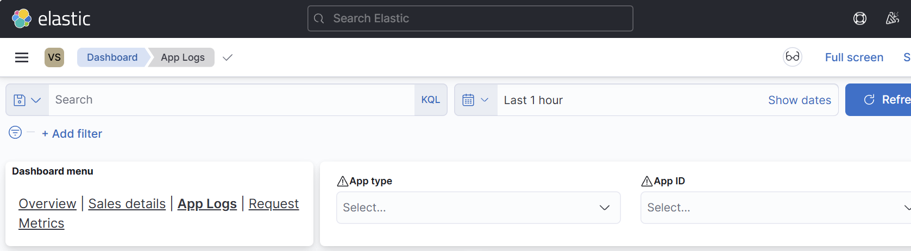

Litium Insights is an essential service that allows you to view application logs, requests, and BI metrics. This tool is invaluable during both development and production workloads.

## Install

Maximum one Litium insights app may be installed per environment. Read more about how to install Litium insights app in the [getting started section](/cloud/serverless/install-litium-insights). 

For logs during deploys/install/update you find those with the [status logs command](/cloud/serverless/view-status-and-logs).

## Login

After installing Litium insights you access Litium insights through your browser with the url: https://insights.litium.cloud

Choose to login with "Serverless account". Use the same credentials you use to login to the CLI. If you dont have an account [you need to create one](/cloud/serverless/create-litium-account).

## App Logs

Litium Insights automatically collect application and request logs from your applications in Serverless cloud. Once logged in to Insights you access your application logs trough menu->Analytics->Dashboard->App Logs


The App Logs view lets you easily filiter on different areas of interest, for instance app type, time span, log level and more.



### Access

To access **App Logs**, users must have:

- At least the role `subscription/reader` for the relevant subscription.
    
- At least the role `apps/litium-insights/insights-logs` for the Litium Insights application.
    

#### Assigning Access

**Give subscription reader access**

```powershell
litium-cloud subscription access-control add \
    --subscription <your-subscription> \
    --email <user-or-group-email> \
    --role subscription/reader
```

**Example 1** - **Grant access to all Insights apps within a subscription:**

```powershell
litium-cloud subscription access-control add \
    --subscription <your-subscription> \
    --email <user-or-group-email> \
    --role apps/litium-insights/insights-logs
```

**Example 2** - **Grant access to a specific Insights app:**

```csharp
litium-cloud app access-control add \
    --subscription <your-subscription> \
    --env <your-environment> \
    --app <app-id> \
    --email <user-or-group-email> \
    --role apps/litium-insights/insights-logs
```

## Request metrics

Litium Insights automatically collects request to your applications. The request metrics section is accessed through menu->Analytics->Dashboard->Request metrics and lets you filter on various things like, domain, time span, specific url etc.

### Access

To access **Request metrics**, users must have:

- At least the role `subscription/reader` for the relevant subscription.
    
- At least the role `apps/litium-insights/insights-logs` for the Litium Insights application.
    

#### Assigning Access

**Give subscription reader access**

```powershell
litium-cloud subscription access-control add \
    --subscription <your-subscription> \
    --email <user-or-group-email> \
    --role subscription/reader
```

**Example 1** - **Grant access to all Insights apps within a subscription:**

```powershell
litium-cloud subscription access-control add \
    --subscription <your-subscription> \
    --email <user-or-group-email> \
    --role apps/litium-insights/insights-logs
```

**Example 2** - **Grant access to a specific Insights app:**

```csharp
litium-cloud app access-control add \
    --subscription <your-subscription> \
    --env <your-environment> \
    --app <app-id> \
    --email <user-or-group-email> \
    --role apps/litium-insights/insights-logs
```

## BI Data

Litium Insights automatically collects BI data form your Litium platform application. The BI data section is accessed through menu->Analytics->Dashboard->Sales details and lets you filter on various things like, time span, product, currency etc.

### Access

To access **BI Data**, users must have:

- At least the role `subscription/reader` for the relevant subscription.
    
- At least the role `apps/litium-insights/insights-bi` for the Litium Insights application.
    
- **Insights Plus** must be enabled for the subscription. It is included by default for recent LCC customers. If BI Data is not visible, please contact [cs@litium.com](mailto:cs@litium.com) to update your agreement to the latest version, free of charge.
    

#### Assigning Access

**Give subscription reader access**

```powershell
litium-cloud subscription access-control add \
    --subscription <your-subscription> \
    --email <user-or-group-email> \
    --role subscription/reader
```

**Example 1** - **Grant access to all Insights apps within a subscription:**

```powershell
litium-cloud subscription access-control add \
    --subscription <your-subscription> \
    --email <user-or-group-email> \
    --role apps/litium-insights/insights-bi
```

**Example 2** - **Grant access to a specific Insights app:**

```csharp
litium-cloud app access-control add \
    --subscription <your-subscription> \
    --env <your-environment> \
    --app <app-id> \
    --email <user-or-group-email> \
    --role apps/litium-insights/insights-bi
```

## Alerts (beta)

Depending on agreement type you may also be eligibale to set up alerts in Litium Insights. You may setup based on a various different of things, such as number of errors of a specific type within a certain timespan, and more. To access and setup alerts, go to menu->Observability->Alerts
