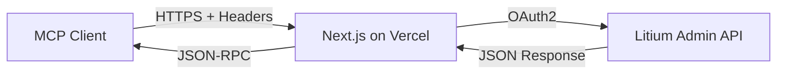

## What is Litium Admin MCP Server?

Litium Admin MCP Server is a Model Context Protocol (MCP) server that provides AI models with programmatic access to the Litium e-commerce platform's Admin Web API. Built with Next.js and deployed on Vercel, it enables AI assistants like Claude and Cursor to interact with your Litium instance.

<CardGroup cols={2}>
  <Card
    title="Quick Start"
    icon="rocket"
    href="/getting-started/installation"
  >
    Get up and running in minutes
  </Card>
  <Card
    title="Tools Reference"
    icon="wrench"
    href="/tools/overview"
  >
    Explore all 28 available tools
  </Card>
  <Card
    title="Configuration"
    icon="gear"
    href="/getting-started/configuration"
  >
    Configure for Cursor or Claude Desktop
  </Card>
  <Card
    title="Deployment"
    icon="cloud"
    href="/guides/deployment"
  >
    Deploy to Vercel or other platforms
  </Card>
</CardGroup>

## Key Features

<AccordionGroup>
  <Accordion title="28 Powerful Tools" icon="toolbox">
    Access 28 tools across 6 domains: Blocks, Products, Customers, Media, Websites, and Orders, plus API discovery tools.
  </Accordion>
  
  <Accordion title="Secure Authentication" icon="lock">
    Uses OAuth2 client credentials flow with header-based credential management. No credentials stored server-side.
  </Accordion>
  
  <Accordion title="Remote Access" icon="globe">
    HTTP/SSE transport allows remote access from any MCP client. No local installation required.
  </Accordion>
  
  <Accordion title="Serverless Deployment" icon="server">
    Deploy to Vercel with one click. Scales automatically and runs on-demand.
  </Accordion>
</AccordionGroup>

## Use Cases

<CardGroup cols={2}>
  <Card title="Content Management" icon="file-lines">
    Create, update, and manage content blocks across your Litium sites
  </Card>
  <Card title="Product Management" icon="box">
    Search, create, and update products in your e-commerce catalog
  </Card>
  <Card title="Customer Service" icon="users">
    Access and manage customer information efficiently
  </Card>
  <Card title="Order Processing" icon="cart-shopping">
    Search and retrieve order details for customer support
  </Card>
</CardGroup>

## Architecture

The server uses a stateless, header-based authentication model:

<Info>
  **No Server-Side Storage**: Credentials are passed via HTTP headers with each request. The server never stores your credentials.
</Info>

## What's Next?

<Steps>
  <Step title="Install">
    Follow the [installation guide](/getting-started/installation) to set up the server
  </Step>
  <Step title="Configure">
    Set up your MCP client with [configuration instructions](/getting-started/configuration)
  </Step>
  <Step title="Authenticate">
    Learn about [OAuth2 authentication](/getting-started/authentication) with Litium
  </Step>
  <Step title="Explore">
    Browse the [tools reference](/tools/overview) to see what you can do
  </Step>
</Steps>

## Support

Need help? Here are some resources:

- [GitHub Issues](https://github.com/tonnguyen/litium-admin-mcp-server/issues) - Report bugs or request features
- [Litium Documentation](https://docs.litium.com/) - Official Litium API docs
- [MCP Specification](https://modelcontextprotocol.io/) - Learn about Model Context Protocol

