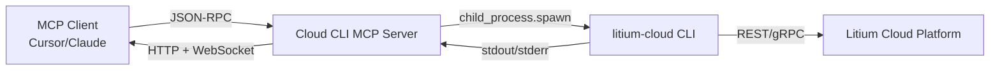

## What is the Litium Cloud CLI MCP Server?

The Cloud CLI MCP Server runs alongside the Litium Cloud CLI (`litium-cloud`) on your workstation and exposes curated tools to AI assistants. It translates natural language requests into safe CLI invocations so you can manage subscriptions, environments, deployments, and access control without typing long commands.

<CardGroup cols={2}>
  <Card title="Install Locally" icon="download" href="/mcp-servers/cloud-cli/getting-started/installation">
    Set up the Node.js server and verify the CLI prerequisites
  </Card>
  <Card title="Configure Clients" icon="gear" href="/mcp-servers/cloud-cli/getting-started/configuration">
    Connect Cursor, Claude Desktop, or VS Code to the server
  </Card>
  <Card title="Tool Reference" icon="wrench" href="/mcp-servers/cloud-cli/tools/overview">
    Browse all available actions and JSON payloads
  </Card>
</CardGroup>

## Why use it?

- Automate Litium Cloud operations through natural language conversations
- Keep credentials on your machine—no remote storage or proxy required
- Stream deployment logs over WebSocket without leaving your editor
- Provide consistent guardrails with validated arguments and audit logs

## Key Capabilities

<AccordionGroup>
  <Accordion title="Infrastructure automation" icon="bolt">
    Deploy apps, track job status, tail logs, and inspect artifacts directly from AI assistants.
  </Accordion>
  <Accordion title="Context-aware helpers" icon="map">
    Store active subscription and environment context per session to reduce repetitive inputs.
  </Accordion>
  <Accordion title="Secure command execution" icon="lock">
    Executes an allowlisted subset of `litium-cloud` commands with argument validation and automatic redaction in logs.
  </Accordion>
  <Accordion title="Streaming telemetry" icon="wave-square">
    WebSocket endpoints expose live job output for long-running deployments or log reviews.
  </Accordion>
</AccordionGroup>

## Architecture

<Info>
  The server never sends credentials over the network. Authentication happens through the locally installed `litium-cloud` CLI, which reuses your service principal or interactive login session.
</Info>

## Supported Client Workflows

<Tabs>
  <Tab title="Cursor">
    Configure an HTTP transport pointing to `http://localhost:7070/mcp` and start asking for deployments or logs. Cursor will automatically invoke the `cloud_cli` tool.
  </Tab>
  <Tab title="Claude Desktop">
    Launch the server via `npx @litium/cloud-cli-mcp-server` inside `claude_desktop_config.json` and restart Claude to load the new MCP integration.
  </Tab>
  <Tab title="VS Code">
    Add the server to `mcp.servers` in `settings.json` or use the GUI under GitHub Copilot Chat to register the HTTP endpoint.
  </Tab>
</Tabs>

## Next Steps

<Steps>
  <Step title="Verify prerequisites">
    Confirm Node.js 18+, `litium-cloud` in your PATH, and an authenticated CLI session (`litium-cloud auth login`).
  </Step>
  <Step title="Install the server">
    Follow the [installation guide](/mcp-servers/cloud-cli/getting-started/installation) to run it via `npx` or locally.
  </Step>
  <Step title="Connect your client">
    Use the [configuration guide](/mcp-servers/cloud-cli/getting-started/configuration) to hook up Cursor, Claude, or VS Code.
  </Step>
  <Step title="Invoke tools">
    Browse the [tool reference](/mcp-servers/cloud-cli/tools/overview) and ask your AI assistant to perform an operation.
  </Step>
</Steps>

