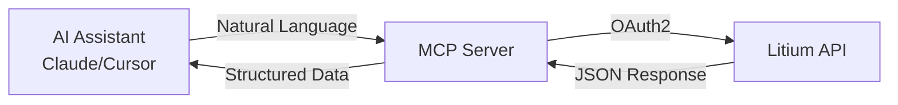

## What are MCP Servers?

Model Context Protocol (MCP) servers provide AI assistants like Claude and Cursor with programmatic access to Litium's APIs. They act as intelligent bridges between AI models and your Litium platform, enabling natural language interactions with your e-commerce data.

<CardGroup cols={2}>
  <Card
    title="Admin MCP Server"
    icon="shield-halved"
    href="/mcp-servers/admin/introduction"
  >
    AI-powered admin operations and platform management
  </Card>
  <Card
    title="Cloud CLI MCP Server"
    icon="cloud"
    href="/mcp-servers/cloud-cli/introduction"
  >
    Automate Litium Cloud infrastructure via the CLI
  </Card>
</CardGroup>

## Available MCP Servers

<AccordionGroup>
  <Accordion title="Admin MCP Server" icon="shield-halved">
    **Full platform management via AI**
    
    Provides 18 domain-based tools across:
    - Products (search, create, update)
    - Content (blocks, pages)
    - Media management
    - Customer operations
    - Order processing
    - Globalization settings
    
    [Get started →](/mcp-servers/admin/introduction)
  </Accordion>
  
  <Accordion title="Cloud CLI MCP Server" icon="cloud-bolt">
    **Infrastructure automation through the Litium Cloud CLI**
    
    - Executes the `litium-cloud` binary for deployments, logs, and access control
    - Includes context-aware helpers for subscriptions, environments, and jobs
    - Offers both HTTP and WebSocket transports for streaming job logs
    - Ships with 25+ curated actions spanning artifacts, marketplace, secrets, and RBAC
    
    [Explore the docs →](/mcp-servers/cloud-cli/introduction)
  </Accordion>
  
</AccordionGroup>

## How MCP Servers Work

<Steps>
  <Step title="Deploy">
    Deploy the MCP server to Vercel or your preferred platform
  </Step>
  <Step title="Configure">
    Set up OAuth2 credentials and API endpoints
  </Step>
  <Step title="Connect">
    Configure your AI assistant to use the MCP server
  </Step>
  <Step title="Interact">
    Use natural language to manage your Litium platform
  </Step>
</Steps>

## Benefits

<CardGroup cols={2}>
  <Card title="Natural Language Interface" icon="comments">
    Ask questions and give commands in plain English
  </Card>
  <Card title="Secure Access" icon="lock">
    OAuth2 authentication with no credential storage
  </Card>
  <Card title="Real-time Operations" icon="bolt">
    Direct API access without intermediate steps
  </Card>
  <Card title="Scalable Architecture" icon="server">
    Serverless deployment with automatic scaling
  </Card>
</CardGroup>

## Getting Started

Ready to set up your first MCP server? Start with the Admin MCP Server:

<CardGroup cols={3}>
  <Card title="Installation" icon="download" href="/mcp-servers/admin/getting-started/installation">
    Deploy to Vercel
  </Card>
  <Card title="Configuration" icon="gear" href="/mcp-servers/admin/getting-started/configuration">
    Set up authentication
  </Card>
  <Card title="Quick Start" icon="play" href="/mcp-servers/admin/getting-started/quickstart">
    First commands
  </Card>
  <Card title="Cloud CLI Setup" icon="terminal" href="/mcp-servers/cloud-cli/getting-started/installation">
    Run the local CLI bridge
  </Card>
</CardGroup>

## Support

- [GitHub Issues](https://github.com/tonnguyen/litium-admin-mcp-server/issues) - Report bugs or request features
- [MCP Specification](https://modelcontextprotocol.io/) - Learn about Model Context Protocol
- [Discord Community](https://discord.gg/litium) - Get help from the community
