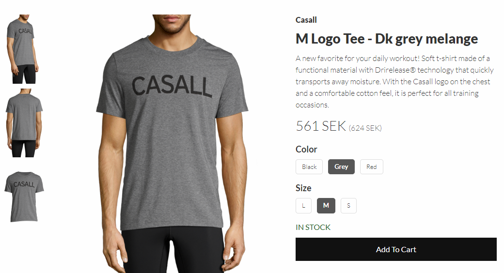
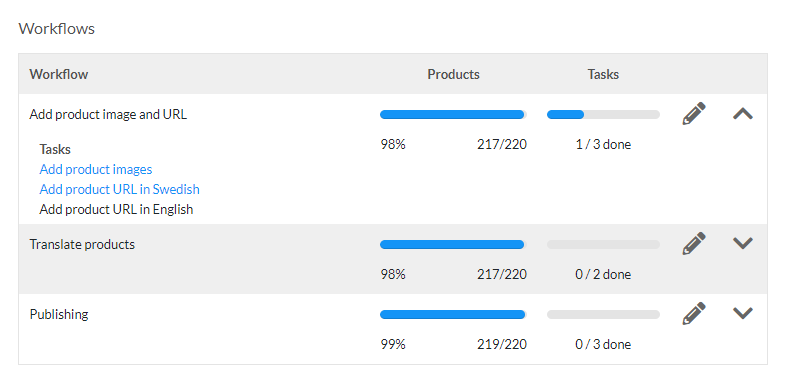
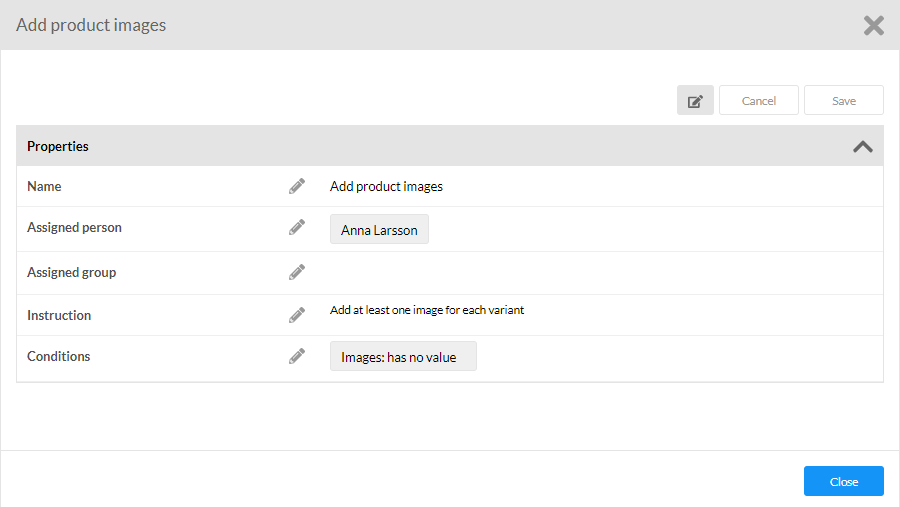

Litium is an e-commerce platform with an integrated PIM and CMS. It is built with .NET technologies and customizable by you as a developer.

This page will give you an overview of the platform, its ingoing areas and surronding products:

- [Areas](#areas)
- [Backoffice](#backoffice)
- [Accelerators](#accelerators)
- [Add-ons](#add-ons)

## Areas

The Litium platform has six areas:

- **Sales** - Order and campaign management
- **Products** - The product information management system (PIM)
- **Websites** - The content management system (CMS)
- **Globalization** - Defines setups of markets, countries, sales channels, currencies, languages and taxes
- **Customers**: User management and personalization, manage all users from administrators to external customers
- **Media**: Manage uploads of files and media (pdf, images, videos etc.)

## Sales

The Sales area contains all orders that has been placed in all websites and channels in the Litium installation.

This is also where you manage campaigns and discounts.

## Products (PIM)

Products can be created in Litium PIM but more often there is an integration to an ERP where products are first created and then sent to Litium to be enriched and published. By using workflows in Litium PIM it is possible to set rules for who should be doing what and provide useful instructions on what needs to be done at all times.

A product in Litium PIM always has a single **baseproduct** and one or many **variants**.

The **variant**:

- Is the physical SKU
- Has price and inventory information
- Is the sellable item, variants are added to the shoppingcart
- Cannot exist without a **baseproduct**

The **baseproduct**:

- Is a container for **variants**
- Not a physical or sellable item
- Should hold all information that is common to all its variants, like _Brand_ and _Description_

The product page in Litium will likely display information from both the baseproduct and the variant. In the image below the _Brand_ and _Description_ are fields on the **baseproduct**. _Images_, _Color_, _Size_, _Price_ and _Quantity in stock_ are set on the **variant**. By selecting values for _Color_ and _Size_ a unique variant can be identified and will be added to cart when the add-button is clicked.

[Read about products data modeling](/platform/guides/data-modelling)

### Related products and categories

Products and categories can be connected using **relations**. Common use cases are to present lists of _accessories_, _similar products_ or _others also bought_ on the product page.

- A relation can be between any combination of category, baseproduct or variant.
    
- Relations can be:
    
    - Directional - a one way relationship where an item points to another item
    - Bi-directional - a two way relationship where two items both point to each other

### Workflows

Workflows are tasks that need to be completed in Litium PIM. You can create workflows to find products that need to be updated with translations, images, price, category or any other missing information.

### Workflow tasks

A workflow is made up of _tasks_, a _task_ is basically a stored product search to identify products that need be processed, a task to _"Add product images"_ is just a search to _"Find all products that does not have a connected image"_:

The task can also have an instruction with more deails on what needs to be done and it can be assigned to individual users or groups.

## Websites

The website area in Litium is a CMS built specifically for e-commerce.

- Create **pages** and publish them though globalization channels into one or more markets
- **Blocks** are page sections that can be individually published and permission managed for simple personalization of a website
    - Blocks allow editors to easily change the page structure without developer involvement
    - A Block can be _Global_ making it reusable in multiple places on the website while still managed in a single location
    - Blocks are rendered on site as [view components](https://docs.microsoft.com/en-us/aspnet/core/mvc/views/view-components?view=aspnetcore-6.0)
- Both **Pages** and **Blocks** support _drafts_ allowing a pending edit to be reviewed before making it public
- Both **Pages** and **Blocks** have the full [field framework](https://start.litium.dev/develop#field-framework)

Read more:

- [Litium user guide on Pages and Blocks](https://docs.litium.com/help/litium-8/websites-cms)
- [Websites data modeling](/platform/guides/data-modelling)

## Globalization

_Globalization_ is a general area that manage access to Litium data through **channels**. When visitors looks at a Litium website they always view it through a **channel** that acts as an information filter, the visitors only see the data configured for that specific channel:

- Only pages enabled on the channel are visible
- Only products enabled on the channel are visible
- Only payment methods enabled on the channel are visible
- Only shipment methods enabled on the channel are visible
- Only currencies methods enabled on the channel are visible
- etc...

The same website in Litium CMS can be exposed through multiple different channel, all different content depending on configuration. Setting up a new channel is simple and does not require additions to the Litium license.

Entities of the _globalization_\-area are:

- **Domain name**
    - Has settings for `robots.txt` and `https`
- **TaxClass**
    - A tax class is only a name, the tax class gets its value when linked to a country, the link will hold the percentage for the tax class in that specific country
- **Language**
- **Currency**
- **Country**
    - Has setting for currency, price lists and inventory that will be used for the country when connected to a channel
- **Channel** (has the field framework)
    - May belong to a market (but only one)
    - May be connected to a website (but does not have to be)
    - May have one or many countries connected (normally a channel will only have a single country)
    - Defines among other things: language, domain name and payment methods
- **Market** (has the field framework)
    - A _market_ is a group of channels
    - _Products_ are sold in a _market_ through _channels_
    - A _market_ can contain multiple _channels_ but a _channel_ can only belong to a single _market_

[Read more about globalization configuration scenarios for markets and channels](/platform/get-started/concepts)

## Customers

The Customers area handles users, organizations and permissions.

- A **Person** is the user account for a user in Litium.
    
- A **Person** may be added to one or more **Groups**:
    
    - Permissions are always set on **Groups** (they cannot be given directly to a **Person**)
    - A **Group** in Litium can be _smart_, _simple or contextual_:
        - In _simple groups_ you manually add or remove members when needed.
        - _Smart groups_ instead define a set of search criteria and all **Persons** with attributes that match the criteria are automatically added (or removed) based on this, as an example a group called _Litium staff_ could be configured to automatically include all **Persons** with an email that contain _"@litium.com"_
        - _Contextual groups_ do not contain persons, and neither has it any connections to persons, like an ordinary group would have in Litium. Instead, conditions are defined for the contextual groups, and evaluated on request to be able to respond whether a person meet the criteria of the contextual group. The person is then still not added to the contextual group, but the response from Litium can be used to understand which organization the person is currently logged in to, and by doing so only grant the permission level for the current organization..

- A **Person** may also be connected to one or more **Organizations**. An **Organization** (company) is usually the customer entity in B2B scenarios and customer information (like delivery address, billing address, customer number etc.) added to the order is fetched from the **Organization** of the current **Person**. In B2C the **Person** is usually also the customer, and customer information is then fetched from the **Person**\-object to the order.
    
- Customer **roles** are set as an attribute on the link between a **Person** and an **Organization**. A **Person** can for example be connected to an **Organization** with the role _"Manager"_. **Roles** are used in Litium accelerator to handle [the order approval flow](/platform/areas/sales/state-transitions).
    
- Each **Role** has several **operations**. An **operation** defines the actions that a **person** with a certain **role** can perform. With this ability you will be able to define and use the following role operations using the Storefront API.
    
    - Read organization
    - Manage organization
    - Read addresses
    - Manage addresses
    - Read persons
    - Manage persons
    - Place orders
    - Approve orders

- **Target groups** are behavior defined groups used for personalization.
    
    - The difference between **Smart groups** and **Target groups** is that **Smart groups** identify logged in **Persons** based on data stored on that **Person**, but **Target groups** only identify **Sessions** (for both logged in and anonymous visitors) based on behavior.
    - Examples of behavior that can be identified in **Target groups** are "Has a specific product in cart" or "Has visited a specific page".
    - Behavior information is stored in cookie and not in database.
    - Read more about [target groups](/platform/get-started/concepts).
- To comply with GDPR, Litium supports exporting and removing user information. Extra audit information is also stored when a user with access to customers or orders logs in. Read more about [GDPR](/platform/guides/data-modelling).
    

[Read about customers data modeling](/platform/guides/data-modelling)

## Media

The Media area handles files in a folder structure. It contains file uploads for all areas, such as products images and website content.

[Read about media data modeling](/platform/guides/data-modelling)

## Back office

Litium backoffice is the administration UI of the platform and is accessed by adding `/litium` to your website URL (use the [Litium db-tool](https://docs.litium.com/documentation/get-started/database-management) or follow the [db-tool guide](/platform/get-started/developer-tools-db-tool) to create a new administrator account after installation).

Litium backoffice is a [SPA](https://developer.mozilla.org/en-US/docs/Glossary/SPA) built with Angular. Extensions added by developers are built as Angular components. There are several extension points available in backoffice where developers can add custom UI and functionality:

- [Dashboard widgets](/platform/areas/dashboard/how-to-create-custom-dashboard-widgets)
- [Custom field framework fields](/platform/guides/data-modelling/how-to-create-custom-field-types)
- [Area-panels](/platform/guides/back-office-ui-extensions/how-to-create-a-custom-panel)
- [Settings pages](/platform/guides/back-office-ui-extensions)

## Accelerators

An accelerator is a storefront starter site to speed up your development and give customers faster time to market and lower risk.

It has a set up of standard best practices for business logic and UX components. 

Litium accelerators are provided as source code making it fully customizable, everything that comes included can be removed or modified. The accelerators have their own release notes.

Benefits include:

- Instant MVP, get a clean e-commerce website instantly and start work by adding value instead of boilerplate code.
    
- Lower risk when you start projects on a tested, maintained and supported codebase.
    
- Having all projects start with the same codebase also makes it easier for developers to move between different projects and work with multiple Litium customers.
    

### Accelerator content

Litium accelerators are a fully functional e-commerce website, some of the things included are:

- A website in the CMS containing created instances of required pages (checkout, order confirmation, navigation, cart, search, filtering, my page, order confirmation)
    
- A product assortment in PIM with some sample categories and products
    
- Templates and fields to create objects in all areas
    
- Globalization artifacts:
    
    - Channel
    - Country
    - Currency
    - Domain name
    - Market
    - Tax class
- Business rules such as validations and state transitions
    
- The search engine Litium search
    

### React accelerator

The React accelerator is a Single Page Application built on React and Next.JS. It communicates with Litium using the Storefront API.

[Read more about the React Accelerator](/accelerators/react/overview)

### MVC accelerator

The MVC accelererator is based on Microsoft .NET MVC and communicates to Litium with the .NET API and the Accelerator Web API.

[Read more about Litium Accelerator](https://docs.litium.com/documentation/litium-accelerators)[s](/accelerators)

## Add-ons

Add-ons are packaged functionality that can be added to Litium installations to provide additional functionality, either in Litium itself or through integration with a third-party service. There are two ways to implement an add-on:

1.  Litium Apps
    
    A Litium App is a stand-alone application that communicates with Litium through our Litium Connect APIs. Litium Apps was introduced with Litium 8. This new architecture gives greater flexibility and scalability to the Litium platform. In Litium 8, all integrations to payment and shipment providers are implemented as apps. Litium Apps are run in Docker containers in the Litium Commerce Cloud.
    
2.  Extensions
    
    An extension is installed as a part of the Litium solution. Extensions are distributed either as:
    
    - Compiled
        - Installed as NuGet packages
        - Run as part of the Litium application
    - Source code
        - Source code is available from Litium
        - Run as part of the Litium application
    
    Be aware that extensions have a dependency to a certain Litium version. When a new version of Litium is released, some extensions might not be available for that version. Verify before project start that required extensions are available.
    

A some commonly used add-ons are:

- [**Payment providers**](/apps/overview): Many supported such as Klarna, Svea, Briqpay and Adyen
- [**Product Media Mapper**](/platform/get-started/concepts): Automatically connects uploaded images to products
- [**Integration kit**](/platform/get-started/concepts): A codebase used to develop file based integrations towards Litium

[See the full list of available Add-ons](/apps/overview)

[Read more about building add-ons](/apps/development-guide/overview)
