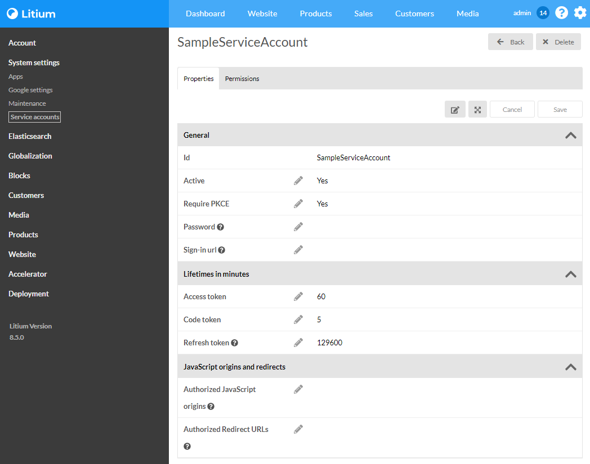
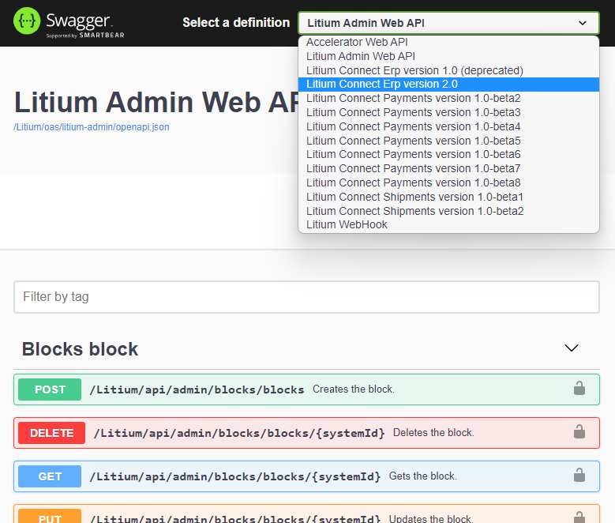

The [Litium .NET API](/platform/apis/dot-net-api) contains all functionality and extension points that are available to developers. But the .NET API is only available when functionality is built as part of the .NET solution.

If you want to develop solutions as external applications and systems that can be modified and scaled without any modification or downtime of the critical e-commerce website you have to develop integrations to Litium. Web API is the most common way of connecting and Litium has made it easy to create custom secure Web APIs, Litium also has several built in Web APIs available:

- **Storefront API** is a GraphQL API used by headless presentation laysers like the [React accelerator](/accelerators/react-accelerator)
- **Litium Connect** is a collection of high level APIs, grouped by business domain
- **Admin Web API** is a low level API containing most of the functionality of the .NET API
- **Accelerator Web API** is the Web API used by the React frontend in the Accelerator MVC Website

[Read more about the APIs](/platform/apis)

## Web API security

The security system that is part of the built in Web APIs is also available when building custom Web APIs. It is based on _Service Accounts_ which is a type of account that can only connect to Web API but not login to the Litium backoffice.

To secure a custom API you only need to add one attribute (or both) to a controller class (or just to a single controller action):

- `OnlyJwtAuthorization` - Add this attribute to only allow requiests with a valid JSON Web Token (JWT)
    
- `OnlyServiceAccountAuthorization` – Add this attribute to only allow `Service Accounts` to make requests
    

You will find more information about [custom Web APIs](/platform/architecture/web-api) and [Web API security](/platform/architecture/web-api/security) in the documentation.

## Admin Web API

The main benefit of the _Admin Web API_ is that it functionally covers almost all of the .NET API, but this also means that changes made in the _.NET API_ will also change the _Admin Web API_.

## Litium Connect

Litium Connect is a collection of APIs grouped by business domain:

- **Connect ERP API**: Contains functionality needed when building an integration to ERP systems, covering for exampe batch data imports, payments and order fulfillment.
- **Connect Payments API**: Used to connect payment service providers such as Klarna, Adyen etc. to authorize/capture/refund payments
- **Connect Shipments API**: Used to connect Litium to warehouse and logistics systems

_(additional APIs for new business domains will be added in the future)_

A major benefit of Litium Connect APIs is that they have versioning that is independent of Litium platform versioning.

<table border="0" cellpadding="0" cellspacing="0" width="800"><tbody><tr height="26"><td width="200"><h3>Litium</h3></td><td width="200"><h3>ERP API</h3></td><td width="200"><h3><b>Payments API</b></h3></td><td width="200"><h3><b>Shipments API</b></h3></td></tr><tr height="26"><td>7.4</td><td>1.0</td><td>-</td><td>-</td></tr><tr height="26"><td>7.6</td><td>2.0</td><td>-</td><td>-</td></tr><tr height="26"><td>7.7</td><td>2.0</td><td>-</td><td>-</td></tr><tr height="26"><td>8.0</td><td>2.0</td><td>1.0</td><td>1.0</td></tr></tbody></table>

By looking at this version table we can see that an ERP integration built for a Litium 7.6 installation will still work when the customer upgrades to Litium 8. The integration could also be re-used for multiple installations running on different versions between 7.6-8.X.

As a general recommendation you should prefer using Litium Connect where suitable and use the Admin Web API as supplement where needed:

1.  Litium Connect (being a high level API) usually requires fewer API calls than the Admin Web API to perform an action
2.  Litium Connect versioning makes integrations more stable and usually a platform upgrade will not require modifications to the integration

[Read more about the Litium Connect APIs](/platform/apis/connect-apis)

## Accelerator Web API

The source code for the Accelerator Web API used by React is available in the MVC project in folder `Controllers\Api`.

## Web hooks

Both the Admin Web API and Litium Connect allow external systems to register themselves to be notified every time a specific event occurs. These subscriptions are registered using webhooks and Litium will call all registered external endpoints when an event is triggered.

[Read more about web hooks](/platform/architecture/events-handling/webhooks)

## Swagger

All Web APIs have Swagger API documentation that is available in every installation on URL http://<domain>/litium/swagger (authentication is required). Swagger covers Accelerator Web API, Litium Connect APIs and the Admin Web API:

