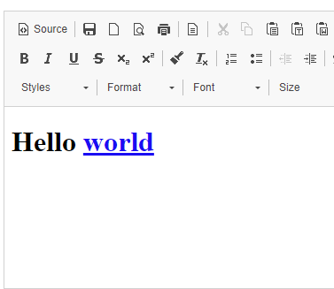
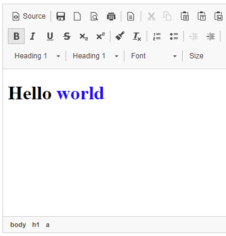

The HTML editor in Litium uses CKEditor. You can customise its appearance and behaviour in several ways:

- Define style sets in `wwwroot/Site/Editor/styles.js`. See the [CKEditor stylesSet API](https://ckeditor.com/docs/ckeditor4/latest/api/CKEDITOR_stylesSet.html).
- Override content CSS in `wwwroot/Site/Editor/editor.css`. See [CKEditor contentsCss](https://ckeditor.com/docs/ckeditor4/latest/api/CKEDITOR_config.html#cfg-contentsCss).
- Provide additional configuration via `wwwroot/Site/Editor/config.js`. See [CKEditor customConfig](https://ckeditor.com/docs/ckeditor4/latest/api/CKEDITOR_config.html#cfg-customConfig).
- Register templates in `wwwroot/Site/Editor/templates.js`. See [CKEditor templates configuration](https://ckeditor.com/docs/ckeditor4/latest/api/CKEDITOR_config.html#cfg-templates_files).

Create a `config.js` file in `wwwroot/Site/Editor` to run custom logic before other configuration files. For example, to keep non-text HTML tags:

```js
var originalConfig = CKEDITOR.editorConfig;
CKEDITOR.editorConfig = function (config) {
  originalConfig(config); // keep the default config
  config.allowedContent = true;
};
```

## Define custom styles

When defining styles, use the style-set name `litium`. Styles are configured in `wwwroot/Site/Editor/styles.js`.

```js
CKEDITOR.stylesSet.add('litium', [
  // Block-level styles
  { name: 'Blue Title', element: 'h2', styles: { color: 'Blue' } },
  { name: 'Red Title', element: 'h3', styles: { color: 'Red' } },

  // Inline styles
  { name: 'CSS Style', element: 'span', attributes: { class: 'my_style' } },
  { name: 'Marker: Yellow', element: 'span', styles: { 'background-color': 'Yellow' } },
]);
```

See the [CKEditor styles guide](https://ckeditor.com/docs/ckeditor4/latest/guide/dev_styles.html) for more information.

## Define custom templates

Templates are configured in `wwwroot/Site/Editor/templates.js`. Use the template-set name `default`.

```js
// Register a template definition set named "default".
CKEDITOR.addTemplates('default', {
  // The name of the subfolder that contains preview images.
  imagesPath: CKEDITOR.getUrl(CKEDITOR.plugins.getPath('templates') + 'templates/images/'),

  // Template definitions.
  templates: [
    {
      title: 'My Template 1',
      image: 'template1.gif',
      description: 'Description of My Template 1.',
      html:
        '<h2>Template 1</h2>' +
        '<p>Type your text here.</p>',
    },
    {
      title: 'My Template 2',
      html:
        '<h3>Template 2</h3>' +
        '<p>Type your text here.</p>',
    },
  ],
});
```

See the [CKEditor templates guide](https://docs-old.ckeditor.com/CKEditor_3.x/Developers_Guide/Templates) for details.

## Define a content style sheet (CSS)

Content styles are configured in `wwwroot/Site/Editor/editor.css`. The following example removes underlines on links:



```css
a {
  text-decoration: none;
}
```

This feature relies on the [stylesheet parser plugin](https://ckeditor.com/docs/ckeditor4/latest/guide/dev_styles.html#the-stylesheet-parser-plugin), which is not included by default.

1. Download the plugin from [CKEditor](https://ckeditor.com/cke4/addon/stylesheetparser).
2. Extract the ZIP and copy it so that `plugin.js` resides in `wwwroot/Site/Editor/plugins/stylesheetparser`.
3. Load the plugin by creating `wwwroot/Site/Editor/config.js` with:

   ```js
   CKEDITOR.plugins.addExternal('stylesheetparser', '/Site/Editor/plugins/stylesheetparser/');
   var originalFn = CKEDITOR.editorConfig;
   CKEDITOR.editorConfig = function (config) {
     originalFn(config);
     config.extraPlugins += ',stylesheetparser';
   };
   ```

Anchor tags in the editor will no longer be underlined.



## Use the native browser spell checker

The built-in spelling dictionaries were removed in Litium 7.4. The native browser spell checker is now enabled instead.

- Set `config.disableNativeSpellChecker` to enable or disable it:

  ```js
  CKEDITOR.editorConfig = function (config) {
    config.disableNativeSpellChecker = false;
  };
  ```

- Ensure spell check is enabled in the user’s browser. (Some browsers do not provide native spell checking.)
- Misspelled words are underlined. Press `Ctrl` when right-clicking to see suggestions.


To change or add languages, use your browser’s language settings.

## Use iframes

Litium 8.12 and later ship with CKEditor 4.21.0, where iframe elements are sandboxed. To allow JavaScript execution in an iframe, configure [`iframe_attributes`](https://ckeditor.com/docs/ckeditor4/latest/api/CKEDITOR_config.html#cfg-iframe_attributes). Example (`wwwroot/Site/Editor/config.js`) that enables embedded YouTube videos:

```js
var originalConfig = CKEDITOR.editorConfig;
CKEDITOR.editorConfig = function (config) {
  originalConfig(config); // keep the default config
  config.iframe_attributes = function (iframe) {
    var youtubeOrigin = 'https://www.youtube.com';

    if (iframe.attributes.src.indexOf(youtubeOrigin) !== -1) {
      return { sandbox: 'allow-scripts allow-same-origin' };
    }

    return { sandbox: '' };
  };
};
```

