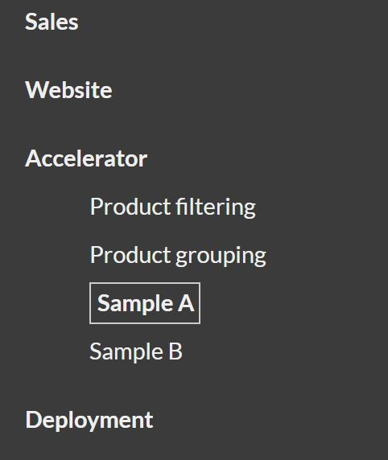
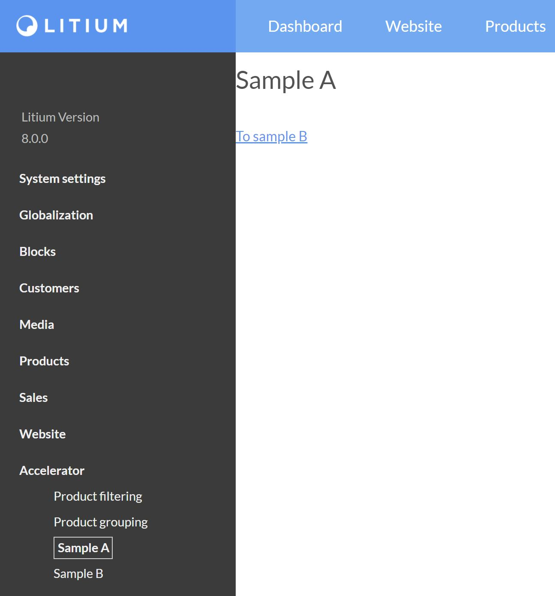

In this article we explain how to create a custom page in the backoffice **Settings** section.

Litium backoffice can be extended with custom components, such as [custom field types](/platform/guides/data-modelling-how-to-create-custom-field-types), [custom widgets](/platform/areas/dashboard/how-to-create-custom-dashboard-widgets), or [custom panels](/platform/guides/back-office-ui-extensions-how-to-create-a-custom-panel). Since Litium 8 you can also create entire custom pages in Settings. This tutorial creates two pages and links between them.



1. [Create sample A and sample B components](#create-sample-a-and-sample-b-components)
2. [Register components and routes](#register-components-and-routes)
3. [Register menu items](#register-menu-items)
4. [Translation](#translation)
5. [Build and run](#build-and-run)
6. [Link to external page](#link-to-external-page)

## Create sample A and sample B components

Create two lightweight Angular components with inline templates (for real projects move templates to separate `.html` files).

```ts
// File: Litium.Accelerator.Administration.Extensions/src/AcceleratorExtensions/components/sample/samplea.component.ts
import { ChangeDetectionStrategy, Component } from '@angular/core';

@Component({
  selector: 'samplea',
  template: `<h1>Sample A</h1>
             <a [routerLink]="['../sampleb']">To sample B</a>`,
  changeDetection: ChangeDetectionStrategy.OnPush,
})
export class SampleComponentA {}
```

```ts
// File: Litium.Accelerator.Administration.Extensions/src/AcceleratorExtensions/components/sample/sampleb.component.ts
import { ChangeDetectionStrategy, Component } from '@angular/core';

@Component({
  selector: 'sampleb',
  template: `<h1>Sample B</h1>
             <a [routerLink]="['../samplea']">To sample A</a>`,
  changeDetection: ChangeDetectionStrategy.OnPush,
})
export class SampleComponentB {}
```

## Register components and routes

Register the components and routes in `Litium.Accelerator.Administration.Extensions/src/AcceleratorExtensions/extensions.ts`.

```ts
import { SampleComponentA } from './components/sample/samplea.component';
import { SampleComponentB } from './components/sample/sampleb.component';

const appRoutes = [
  {
    path: '',
    children: [
      { path: 'samplea', component: SampleComponentA },
      { path: 'sampleb', component: SampleComponentB },
    ],
  },
];

@NgModule({
  declarations: [
    SampleComponentA,
    SampleComponentB,
  ],
```

That covers the client-side changes. Next register menu items.

## Register menu items

`SettingsMenuProvider.cs` (inside `Litium.Accelerator.Administration.Extensions`) controls the left menu in Settings. Update the `Children` property to include the new pages:

```csharp
Children = new[]
{
    ("/Litium/UI/settings/extensions/AcceleratorExtensions/samplea", "accelerator.setting.search.samplea", true),
    ("/Litium/UI/settings/extensions/AcceleratorExtensions/sampleb", "accelerator.setting.search.sampleb", true),
};
```

Notes:

- The `/Litium/UI/settings/extensions/` prefix is required.
- `AcceleratorExtensions` is the module name defined in `extensions.ts`. The module is registered via `AngularModuleAttribute` and exposed in `webpack.js` using `ModuleFederationPlugin`. See [Module Federation](https://webpack.js.org/concepts/module-federation/) for more details.
- `samplea` and `sampleb` match the routes added in the previous step.
- The second tuple value is the translation key.
- The final boolean controls visibility.

## Translation

Add translation keys to `Litium.Accelerator.Administration.Extensions/Resources/Administration.resx` (and other languages as needed):

```xml
<data name="accelerator.setting.search.samplea" xml:space="preserve">
  <value>Sample A</value>
</data>
<data name="accelerator.setting.search.sampleb" xml:space="preserve">
  <value>Sample B</value>
</data>
```

## Build and run

From the `Src` folder:

- Run `yarn run build-extensions:w` (or `npm run build-extensions:w`) while developing to rebuild incrementally.
- For production builds, run `yarn run prod` or `npm run prod`.
- Build the `Accelerator.sln` solution.

Open the backoffice and navigate to Settings. The new pages appear under **Accelerator** and link to each other.



## Link to external page

To add menu items that link to external pages, update `SettingsMenuProvider` with:

```csharp
Children = new[]
{
    ("https://www.litium.com", "External link", true),
    ("settings/iframe/" +
        HttpUtility.UrlEncode(new Uri("https://www.litium.com").AbsoluteUri),
        "Open in iFrame", true),
};
```

