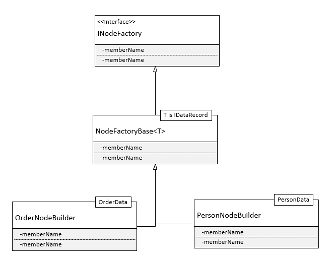
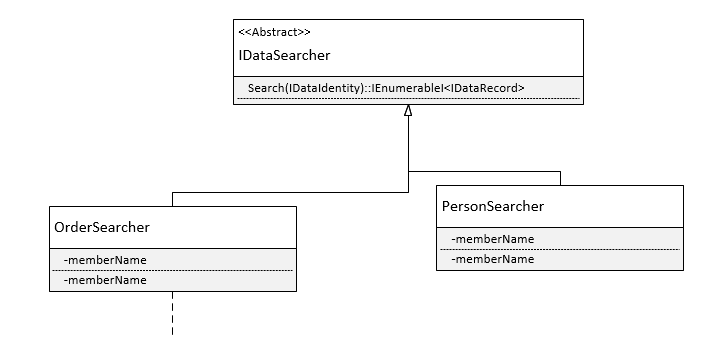
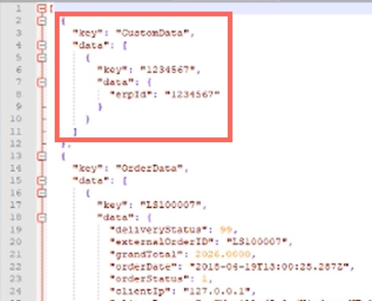

You can add and modify the information that is included in the GDPR delete and export functionality, for example, include information stored in third party systems.

We recommend that you create a GDPR project in your solution, which you can use to control these features. Alternatively you can place the code in the accelerator DLL or any other project you have. Then add a dependency to _Litium.Abstractions_.

## Adding data from an external system to the GDPR info in Litium

To add data from an external system, for example an ERP system, that should be included when you delete or export data through the GDPR feature in Litium, you need the following components:

- [A class that defines the data record to be included](#datarecordclass) (_CustomData_ in this example).
- [A class that specifies the data that should be included in the data record](#definedata) (_ErpCustomerData_ in this example).
- [A class/service that exports or deletes the custom data](#deleteexportclass) (_GdprCustomDataExport_ in this example).
- [A class that searches for data](#searchclass) (_GdprCustomDataSearcher_ in this example).
- [A class that implements the data deletion](#implement) (_GdprCustomDataRemover_ in this example).

The complete code for this example can be found [here](./files/Litium.Docs.Samples.Gdpr.zip).

To delete or export the custom information through the GDPR feature you need to follow the pattern shown in the class diagram below.



### 1\. Add a data record class

Define the custom data to be exported (or deleted) as a data record by creating a class according to the pattern in the class diagram below. `<T>` in `DataRecord<T>` is the class that defines the custom data (_ErpCustomerData_ in this example, see step 4).


`DataRecord<T>` has a parameter called _Data_, that needs to be populated to be accessed.

```csharp
namespace Litium.Docs.Samples.Gdpr
{
    public class CustomData : DataRecord<ErpCustomerData>
    {
        public CustomData(ErpCustomerData arg)
        {
            Data = arg;
        }
    }
}
```

### 2\. Add a class that defines the data to be included in the data record

In this class you define what data is included in the data record that has been specified as custom data. In other words, this class defines the `<T>` in `DataRecord<T>`.

```csharp
public class ErpCustomerData
{
    public string ErpId { get; set; }

    public string Secret { get; set; }
}
```

### 3\. Add a public class for deleting and exporting the custom data, and implement the abstract class

This service will delete or export the custom data that you have defined in the previous steps. You can also exclude certain data from the deletion/export by specifying which properties to exclude.

- _Name_: Set the name of the service to the data record class (_CustomData_ in this example).
- _ExtractData_: Should return the _Data_ parameter specified in _CustomData_.
- _ExtractId_: Should return the ID of the data record, in this example the same as the ErpId.
- _GetExcludedProperties_: Specifies any custom data that should be excluded from the GDPR features.

```csharp
[Service(Name = nameof(CustomData), FallbackService = true)]
public class GdprCustomDataExport : NodeFactoryBase<CustomData>
{
    protected override object ExtractData(CustomData arg)
    {
        return arg?.Data;
    }

    protected override string ExtractId(CustomData arg)
    {
        return arg?.Data?.ErpId;
    }

    protected override ISet<PropertyInfo> GetExcludedProperties()
    {
        return new HashSet<PropertyInfo>
        {
            typeof(ErpCustomerData).GetProperty(nameof(ErpCustomerData.Secret))
        };
    }
}
```

### 4\. Search for data

Add a public class according to the following pattern (_GdprCustomDataSearcher_ in this example), and then implement the _IDataSearcher_ interface.



The data found needs to be returned as an _IEnumerable_ data record. The _IDataIdentity_ parameter contains the identity of the data principal.

Note! In the example below the search function has not been implemented. The customer data has been added manually for demonstration purposes only.

```csharp
public class GdprCustomDataSearcher : IDataSearcher
{
    public IEnumerable<IDataRecord> Search(IDataIdentity identity)
    {
        //TODO: search for erp data.
        var erpCustomer = new ErpCustomerData { ErpId = "1234567", Secret = "Hello world!" };
        return new List<CustomData> { new CustomData(erpCustomer) };
    }
}
```

### 5\. Build the customised delete/export feature

Remember to include the project in the accelerator MVC when building the solution, which means the DLL file will be copied at the same time. Refresh the web page and test the GDPR export in back office. In the Customers area, doubleclick a person and then click Settings > GDPR > Export.


Open the resulting JSON file and verify that your custom data has been exported (erpId, "1234567" in this example), and that any data that you excluded has not been exported.



Deleting and exporting from the Sales area works according to the same principles.

### 6\. Implement the deletion

The following code is a dummy delete implementation.

```csharp
using Litium.GDPR;
using Litium.Runtime.DependencyInjection;
using System;
using System.Collections.Generic;

namespace Litium.Docs.Samples.Gdpr
{
    [Service(Name = nameof(CustomData), FallbackService = true)]
    public class GdprCustomDataRemover : EntityRemoverBase<CustomData>
    {
        public override void Delete(CustomData dataRecord)
        {
            //TODO: remove the customer data
        }

        protected override void EnsureDeleted(IEnumerable<Guid> systemIds)
        {
        }
    }
}
```

You can modify or replace the default implementations using the service decorator pattern. The following code fragment, for example, can be used to modify the default implementation for _PersonNodeBuilder_.

```csharp
using Litium.GDPR;
using Litium.Runtime.DependencyInjection;

namespace Litium.Docs.Samples.Gdpr
{
    [ServiceDecorator(typeof(INodeFactory), Name = nameof(PersonData))]
    public class CustomPersonNodeBuilder : INodeFactory
    {
        private readonly INodeFactory _nodeFactory;

        public CustomPersonNodeBuilder(INodeFactory nodeFactory)
        {
            _nodeFactory = nodeFactory;
        }

        public ExportNode Create(IDataRecord dataRecord)
        {
            var defaultImplementation = _nodeFactory.Create(dataRecord);

            //TODO: modify the default implementation.
            return defaultImplementation;
        }
    }
}
```

[Back to the top](#topofpage)
