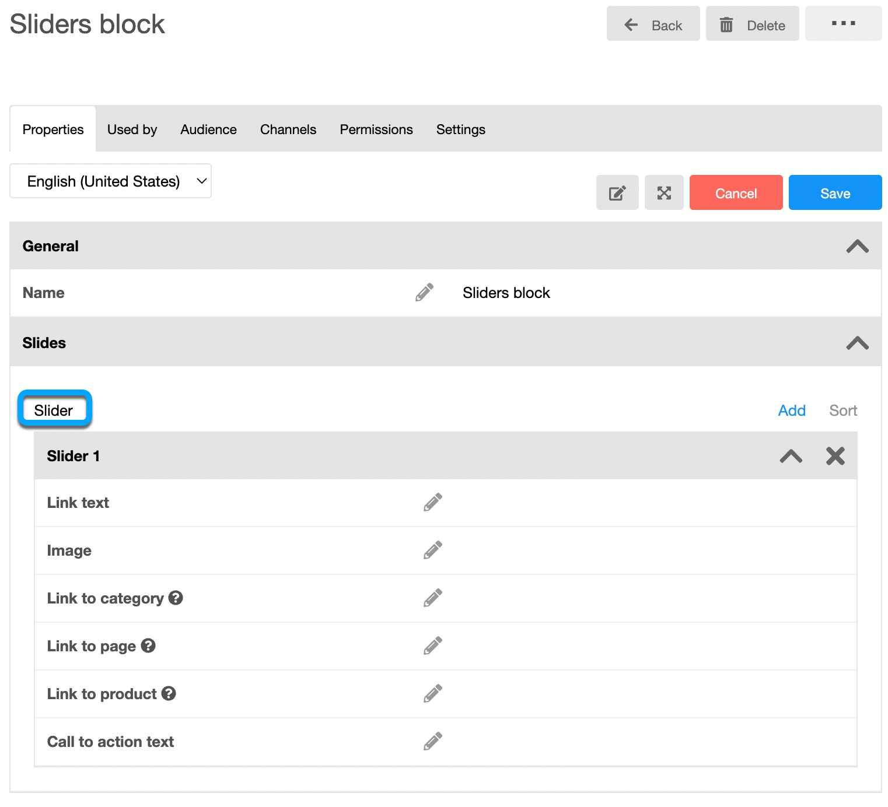
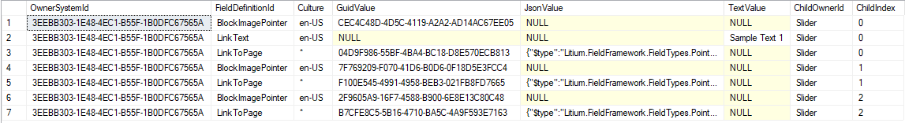

An example of setting up a banner slider in .NET.

## Slider block in the MVC accelerator

For example, in the slider block in the MVC accelerator, we need to store an array of slides into a block's field. Each slide contains _LinkText_, _ImagePointer_ and _LinkToPage_. 



Sample code performing the following actions:

1.  Create a MultiField definition.
2.  Create a group field template and link the MultiField to that template.
3.  Create a static group and assign some values to the MultiField we have created in the first step.

```csharp
public void Multi_Field_Group_Sample()
{
    //Create MultiField definition
    var multiFieldDefinition =
        new FieldDefinition<CustomerArea>(this.UniqueString(), SystemFieldTypeConstants.MultiField)
        {
            Option = new MultiFieldOption
            {
                IsArray = true,
                Fields = new List<string>
                {
                    SystemFieldDefinitionConstants.Name,
                    SystemFieldDefinitionConstants.Email,
                }
            }
        };
    _fieldDefinitionService.Create(multiFieldDefinition);

    //Create group field template and assign the MultiField definition to group
    var sampleGroupFieldTemplate = new GroupFieldTemplate(this.UniqueString())
    {
        FieldGroups = new[]
        {
            new FieldTemplateFieldGroup()
            {
                Id = "General",
                Collapsed = false,
                Fields =
                {
                    multiFieldDefinition.Id
                }
            }
        }
    };
    _fieldTemplateService.Create(sampleGroupFieldTemplate);

    //prepare multi field data 
    var innerData1 = new MultiFieldItem { AreaType = typeof(CustomerArea) };
    innerData1.Fields.AddOrUpdateValue(SystemFieldDefinitionConstants.Name, CultureInfo.CurrentCulture, "name1");
    innerData1.Fields.AddOrUpdateValue(SystemFieldDefinitionConstants.Email, "email1@domain.com");
    var innerData2 = new MultiFieldItem { AreaType = typeof(CustomerArea) };
    innerData2.Fields.AddOrUpdateValue(SystemFieldDefinitionConstants.Name, CultureInfo.CurrentCulture, "name2");
    innerData2.Fields.AddOrUpdateValue(SystemFieldDefinitionConstants.Email, "email2@domain.com");

    //Create a sample static group and assign multi field value to it:
    var sampleGroup = new StaticGroup(sampleGroupFieldTemplate.SystemId, this.UniqueString());
    sampleGroup.Fields.AddOrUpdateValue(multiFieldDefinition.Id, new[] { innerData1, innerData2 });
    _groupService.Create(sampleGroup);

    //Retrieve the group we've created and extract the multifield value
    var savedGroup = _groupService.Get<StaticGroup>(sampleGroup.SystemId);
    savedGroup.Fields.TryGetValue(multiFieldDefinition.Id, out var multiFieldValue);

    //Retrieve values
    if (multiFieldValue is IList<MultiFieldItem> list)
    {
        var count = list.Count; // should be 2
        var name1 = list.First().Fields.GetValue<string>(SystemFieldDefinitionConstants.Name, CultureInfo.CurrentCulture); // should be "name1"
        var email1 = list.First().Fields.GetValue<string>(SystemFieldDefinitionConstants.Email); //Should be "email1@domain.com"
        var name2 = list.Last().Fields.GetValue<string>(SystemFieldDefinitionConstants.Name, CultureInfo.CurrentCulture); // should be "name2"
        var email2 = list.Last().Fields.GetValue<string>(SystemFieldDefinitionConstants.Email); //Should be "email2@domain.com"
    }
}
```

The MultiField data is stored in the same tables as normal fields (_`<EntityType>FieldData`_). Based on the _ChildOwnerId_ and _ChildIndex_ columns, we can group the individual values into objects. In the example below, we have three slides of the MultiField with the Id _Slider._ _ChildIndex_ with the value 0 belongs to the first slide, and so on.



## Custom validation

Implementations can create custom validation by implementing the IValidationRule interface. When validating MultiField nested fields, a custom validation rule must follow a specific convention for constructing the error ID. This ensures the system can correctly associate and display validation messages with the corresponding fields. The following example demonstrates this convention.:

```csharp
[Service(Lifetime = DependencyLifetime.Scoped)]
internal class BaseProductRuleCustomForMultiField : ValidationRuleBase<BaseProduct>
{
    public override ValidationResult Validate(BaseProduct entity, ValidationMode validationMode)
    {
        var result = new ValidationResult();

        if (validationMode != ValidationMode.Remove)
        {
            var multifieldId = "multiField";
            var multiFieldItems = entity.Fields.GetValue<List<MultiFieldItem>>(multifieldId);
            
            // Iterate through each item in the multifield to apply validation.
            for (int i = 0; i < multiFieldItems.Count; i++)
            {
                // This is where your actual validation logic goes.
                // For instance, you could check if the "Color" field is empty.
                var validatedFieldId = "Color";
                // The key for the error message must follow this specific format:
                // {multiFieldId}_{baseProductSystemId}|{fieldId}|{index}
                // Note: The {index} starts at 1, so we use 'i + 1'
                result.AddError($"{multifieldId}_{entity.SystemId}|{validatedFieldId}|{i + 1}", "Color is required");
            }

            // Use this line to add a general, non-specific error to the result.
            // result.AddError("*", "error message");
        }

        return result;
    }
}
```

For more information on validation, see: [Object Validation](/platform/get-started/concepts).
