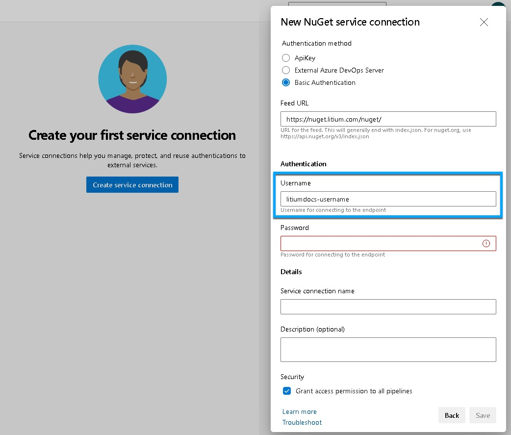
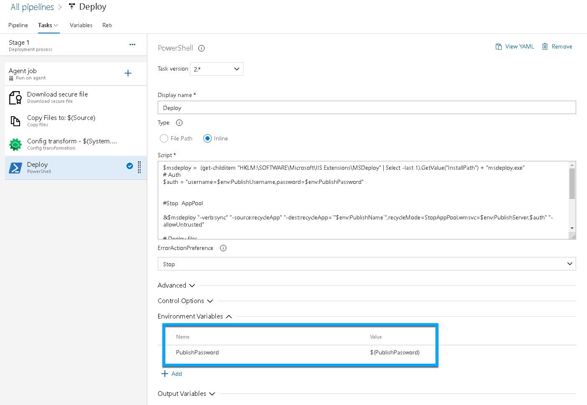

How to get up and running with Azure DevOps and Web deploy for the Litium accelerator.  
Note, this guide is made with default Litium 8 accelerator in mind.

How get started with Azure Devops and Web deploy for the default Litium 8 Accelerator:

[NuGet-feeds](#nuget feeds)

[Build pipeline](#build pipeline)

[Variable group](#variable group)

[Release pipeline](#release pipeline)

Should you need more detailed information on how to set up your pipelines, please refer to [Microsoft's official documentation](https://docs.microsoft.com/en-us/azure/devops/pipelines/?view=azure-devops).

### NuGet-feeds

In your project, add Service-connections to authenticate against the NuGet-feeds:

1. Navigate to **Project Settings** > **Service connections**. 

2\. Click on **New Service Connection**.

3\. Choose **Basic Authentication** and enter your Nuget-credentials. Your credentials are the same ones that you use on Litium docs. 

We are going to use “Litium” since the YAML-sample refers to it.

### Build pipeline

To build your release artifact you need to add a build pipeline:

1. Navigate to Pipelines and click on **New pipeline**.

2\. Choose where your code is located and what repository you want to use.

3\. Click **Next** and choose “[ASP.NET](http://asp.net/)  Core (.NET Framework).

In the Review-step you will remove all unwanted steps in your pipeline and then [add the steps in the link](/platform/guides/deployment-azure-devops-and-webdeploy-azure-devops-pipelines-yml). 

These build-steps are there to get you up and running quickly. Please see the [official Microsoft documentation for further options and guidance](https://docs.microsoft.com/en-us/azure/devops/pipelines/?view=azure-devops).

### Variable group:

1. Navigate to Library. 

2\. Create a new variable group.

3\. Add the following variables:

| Name | Value |
| --- | --- |
| PublishName | `<< value of msdeploySite>>` |
| PublishUsername | `<< Litiumdrift-user>>` |
| PublishPassword (make it secret) | `<< password of Litiumdrift-user>>` |
| PublishServer | `https://[SERVER].litiumdrift.se:8172/msdeploy.axd` |
| Source | `$(System.DefaultWorkingDirectory)/_<Name of project>/LitiumBuildArtifact (Name of project with leading "_")` |
| ExtractedSource | `$(System.DefaultWorkingDirectory)/_<Name of project>/LitiumBuildArtifact/Publish` |

Some of the settings found in PublishSettings-file can also be found on the customer website.

### Release pipeline

Select the artifact that is created with your release pipeline:

1\. Below tab ‘Variables’, link to the variable group you created earlier.

2\. Add stage with “Emtpy job”-template

- Add ‘Extract files’-task
    
    - Change ‘Destination folder’ to: $(Source)\\Publish
        
    - Check ‘Clean destination folder before extracting’
        
    - Check ’Overwrite existing files’
        
- Add ‘Download secure file’-task (Optional step; Some prefer to have it checked in with the source code)
    
    - Upload your license-file for the customer
        
- Add ‘Copy files’-task (If previous task was added)
    
    - Change ‘Source Folder’ to: $(Agent.TempDirectory)
        
    - Change ‘Content’ to: license.json
        
    - Change Target folder: $(ExtractedSource)
        
- Add config transformations (optional). This step uses Magic Chunk and can be installed to your azure DevOps instance from Marketplace
    
    - Change ‘Path’ to: $(ExtractedSource)\\appsettings.json
        
    - Change ‘Type’ to ‘Inline’
        
    - Paste following in [Transformation.txt](https://docs.litium.com/documentation/litium-cloud/deployment/azure-devops-and-webdeploy/script)
        
- Add ‘Powershell’-task
    
    - Change ‘Type’ to ‘Inline’
        
    - Paste content from [Deploypsscript.txt](https://docs.litium.com/documentation/litium-cloud/deployment/azure-devops-and-webdeploy/script)
        
    - Add following variable in this task:

        | Name | Value |
        | --- | --- |
        | PublishPassword | `$(PublishPassword)` |

This is a necessary step since passwords in the variable group are tagged as Secret. 

### Feedback and additional questions

Please leave feedback below or contact [Litium support](https://support.litium.com) for any additional questions.
