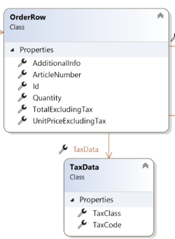

This section explain how to get the tax code for a product.

Many external tax calculation systems rely on a tax code for a physical product to be passed with the line item. They also usually support a mapping function where you can map the article number to a specific tax code. 

From Litium, you have access to both the article number of a variant purchased and its tax code.

The TaxCode need to be setup in Litium side, to be available here. In the field template for your variant, you should have a text field with the id "TaxCode". If this field is present, Litium will read it and automatically populate it when calling the tax app.

You may also pass the tax\_code using the AdditionalInfo property of the Litium order row. Simply create a key named "\_taxCode" with the product taxcode as its value and add to the order row additionalInfo dictionary. 

If both the varient field TaxCode and order row additional info property \_taxCode is present, the additional info value will be the one that gets selected.

In addition to tax code, you will also have access to the Litium tax class id for the variant. TaxData.TaxClass is the Litium TaxClass.Id.
