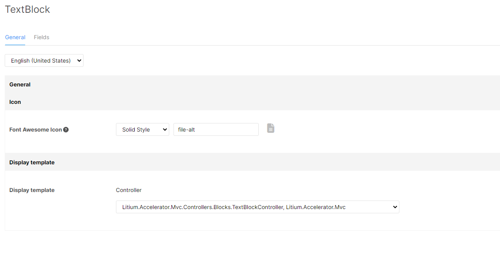
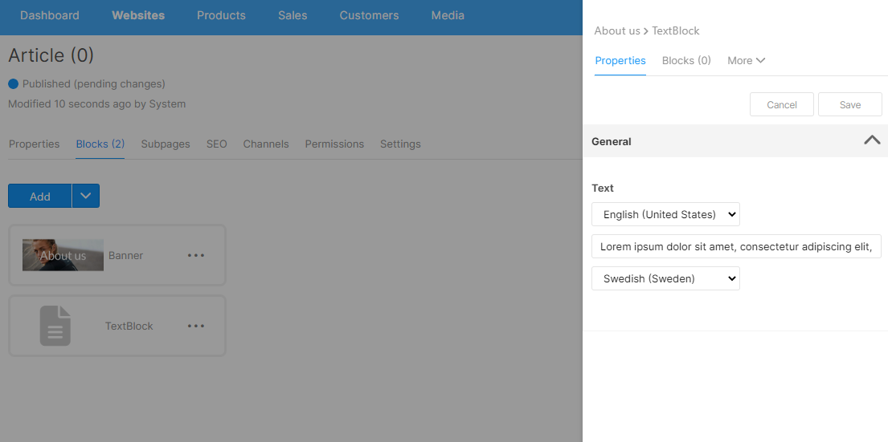
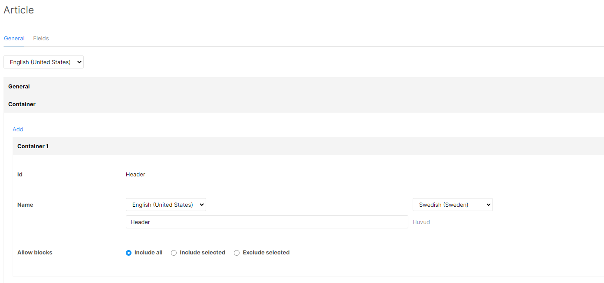

Litium MVC accelerator is shipped with blocks that can be used for reference. The following components are required to create a custom block:

- **Block template**: to define the block type, what fields it has, and how to display it on the website.
- **Display template**: an MVC action to render the block in the website.
- **View** to render the block.

## Create a block template

A block template can be created via the UI and from code (under _Litium.Accelerator\\Definitions\\_). 

To do it via the UI:

1.  Click on the cogwheel in back office
2.  Select **Blocks** \> **Field Templates** in the left menu.

When a block is created, a block Id is mandatory. Let's create a block template with _Text_ as Id and name. We will configure it later when we have created a controller. We can configure the icon for the block template, so when editing page in block mode, a block template's icon will be shown in the **Add Block** panel. The icon value should be the class name of the Font Awesome icon, for example: _paragraph_. The [list of icons can be found](https://fontawesome.com/search?m=free&o=r) [here](https://fontawesome.com/search?m=free&o=r). The system supports Font Awesome 6.2.1.

We can specific which block templates are allowed or not allowed to be added into _Text_ block by edit **Allow blocks** property. Usually a _Text_ block should not contain any children, so we should choose **Include selected**, with an empty list.

_Text_ block should have a text field so it can store a text value. Let's create one with the Id _Text_ and add it under the **Fields** tab:

## Create a display template

We need a controller to render _Text block_, configured as a display template.

### Create a model

Create _TextBlockViewModel_ under _Litium.Accelerator\\ViewModels\\Block:_

using AutoMapper;
using JetBrains.Annotations;
using Litium.Accelerator.Builders;
using Litium.Accelerator.Extensions;
using Litium.Runtime.AutoMapper;
using Litium.Web.Models.Blocks;

namespace Litium.Accelerator.ViewModels.Block
{
    public class TextBlockViewModel : IViewModel, IAutoMapperConfiguration
    {
        public string Text { get; set; }

        \[UsedImplicitly\]
        void IAutoMapperConfiguration.Configure(IMapperConfigurationExpression cfg)
        {
            cfg.CreateMap<BlockModel, TextBlockViewModel>()
               .ForMember(x => x.Text, m => m.MapFromField("Text"));
        }
    }
}

### Create a builder

The builder is a component of the Business Logic Layer (BLL), to create a common layer that can be consumed by the MVC or Web API. We will create _TextBlockController_ and use the builder in the next step, but this is not mandatory. We can also choose to use only the controller. The builder, however, will help us if we want to use another approach than MVC to render a block, since we have a common layer to reuse. Please read more about the [BLL and the architecture of Litium Accelerator here](/accelerators/mvc-accelerator).

Create a builder under _Litium.Accelerator\\Builders\\Block:_

using Litium.Accelerator.ViewModels.Block;
using Litium.Runtime.AutoMapper;
using Litium.Runtime.DependencyInjection;
using Litium.Web.Models.Blocks;

namespace Litium.Accelerator.Builders.Block
{
    \[Service(ServiceType = typeof(TextBlockViewModelBuilder))\]
    public class TextBlockViewModelBuilder : IViewModelBuilder<TextBlockViewModel>
    {
        public virtual TextBlockViewModel Build(BlockModel blockModel)
        {
            return blockModel.MapTo<TextBlockViewModel>();
        }
    }
}

In this builder we use _AutoMapper_ to map the text field from the field we named **Text** in our **Text block** template. So when _blockModel.MapTo<TextBlockViewModel>()_ is executed, the value of the **Text** field in the **Text block** template is set to the text field of the _TextBlockViewModel_.

We created the model and builder in the _Litium.Accelerator_ project, which is a common one. Go to the _Litium.Accelerator.Mvc_ project to create a controller and a view that use the model and builder we just created.

### Create a controller

Create _TextBlockController_ under _Litium.Accelerator.Mvc\\Controllers\\Blocks:_

using Litium.Web.Models.Blocks;
using Litium.Accelerator.Builders.Block;
using Microsoft.AspNetCore.Mvc;

namespace Litium.Accelerator.Mvc.Controllers.Blocks
{
    public class TextBlockController : ViewComponent
    {
        private readonly TextBlockViewModelBuilder \_builder;

        public TextBlockController(TextBlockViewModelBuilder builder)
        {
            \_builder = builder;
        }

        public IViewComponentResult Invoke(BlockModel currentBlockModel)
        {
            var model = \_builder.Build(currentBlockModel);
            return View("~/Views/Blocks/Text.cshtml", model);
        }
    }
}

The controller does not do much work. It just asks _TextBlockViewModelBuilder_ to build the model, and render a partial view using _Text.cshtml_. All block controllers must inherit the _ViewComponent_ base class and implement the Invoke-method that returns an IViewComponentResult.

Create the view under _Litium.Accelerator.Mvc\\Views\\Blocks_:

@model Litium.Accelerator.ViewModels.Block.TextBlockViewModel

    
@Model.Text

## Configure a display template

We have already created a display template. Build the solution and configure one for **Text block**:

**Text block** is now ready to use and you can edit a page, for example an article page, in blocks mode and add the block to a page container.

## How it works

We created a block template, added the block to an article page where **Text block** is rendered properly. Now let us see how the rendering is done.

The article page is a page template configured to use _ArticleController_ as display template. When we take a look at the _Index_ action of _ArticleController_, we can see that it calls _ModelBuilder_ to build the model and pass it on to the _Article\\Index.cshtml_ view to render the article page. _ArticleViewModel_ has a block field that serves as a dictionary between the Id of a block container and the list of blocks which should be there.

Block containers are configured in the page template. It defines how many containers we have for the article page. In the article view we can display different containers in different location, as we wish.

This is how a container is rendered in the article page (_Views\\Article\\Index.cshtml_) In this example, **Article** has only one container called **Header**.

When adding a container to a page template, remember to add the following snippet to the Razor view, in order to render the container:

@await Component.BlockContainerAsync(Model.Blocks, BlockContainerNameConstant.Header)

_@Component.BlockContainerAsync_ is an extension method for _IViewComponentHelper_, which is defined in _Litium.Accelerator.Mvc\\BlockContainerHelperExtension.cs_. This extension method makes sure that we render the container's blocks with the following tag builder section. 

var tagBuilder = new TagBuilder("section");
tagBuilder.Attributes\["data-litium-block-id"\] = blockModel.SystemId.ToString();
tagBuilder.InnerHtml.AppendHtml(await component.InvokeAsync(controllerType, blockModel));

builder.AppendHtml(tagBuilder);
builder.AppendLine();

It renders all blocks, and every block should be rendered inside a section tag with the _data-litium-block-id_ attribute. This attribute is a special one, and must be added to every block. The page edit engine uses the attribute to find a block, in order generate a thumbnail for it. Without this attribute, the system cannot find the block in the HTML code, so it cannot extract the thumbnail. Note that this only impacts the page edit feature in back office, not how the block is rendered in the website. Without that attribute, the block will still be rendered correctly.

_BlockContainerAsync_ extension method is implemented there to help us render a block easily. When we create a custom block, we don't have to worry about that. The implementation can be done in another way, but make sure that the _data-litium-block-id_ attribute is there for every block. Its value must be the system Id of the block.

With this _data-litium-block-id_ attribute, the website or the actual block component can be implemented in any technology and any framework. For example, we have the slider block, which is rendered as a React component. The page edit can still capture the thumbnail of the block, as long as it finds the _data-litium-block-id_ attribute. It can be an MVC website, a hybrid website with MVC and some React components, or we can go all the way to single-page application, implemented in other UI frameworks too. We are not locked to React.

## Create nested blocks

Nested blocks feature was introduced in Litium 8.9, which allows editors to add block to a block. We will create a layout block which renders blocks in a two columns layout, for example, one Text block on left column and another Text block on right column. We follow same steps as creating a Text block:

Create _TwoColumnsBlockController_ for display _TwoColumns_ block.

public class TwoColumnsBlockController : ViewComponent
{
    private readonly TwoColumnsBlockViewModelBuilder \_builder;

    public TwoColumnsBlockController(TwoColumnsBlockViewModelBuilder builder)
    {
        \_builder = builder;
    }

    public IViewComponentResult Invoke(BlockModel currentBlockModel)
    {
        var model = \_builder.Build(currentBlockModel);
        return View("~/Views/Blocks/TwoColumns.cshtml", model);
    }
}

Create a _TwoColumns_ block template:

- Id: _TwoColumns_
- Icon: _table-columns_
- Include selected: _Text_ as we will allow to add Text block as children
- Display template: configue to use _TwoColumnsBlockController_.

Create _TwoColumnsBlockViewModelBuilder,_ _TwoColumnsBlockViewModel._

\[Service(ServiceType = typeof(TwoColumnsBlockViewModelBuilder))\]
public class TwoColumnsBlockViewModelBuilder : IViewModelBuilder<TwoColumnsBlockViewModel>
{
    public virtual TwoColumnsBlockViewModel Build(BlockModel blockModel)
    {
        return blockModel.MapTo<TwoColumnsBlockViewModel>();
    }
}

public class TwoColumnsBlockViewModel : IViewModel, IAutoMapperConfiguration
{
    public IList<BlockModel> Children { get; set; }

    \[UsedImplicitly\]
    void IAutoMapperConfiguration.Configure(IMapperConfigurationExpression cfg)
    {
        cfg.CreateMap<BlockModel, TwoColumnsBlockViewModel>();
    }
}

The _BlockContainerAsync_ is need to updated to support show nested blocks. We can modify it like this sample.

public static async Task<IHtmlContent> BlockContainerAsync(this IViewComponentHelper component, Dictionary<string, List<BlockModel>> containers, string containerId)
{
    if (containers == null || !containers.TryGetValue(containerId, out var blocks) || blocks.Count == 0)
    {
        return new HtmlContentBuilder();
    }

    return await component.BlocksAsync(blocks);
}

public static async Task<IHtmlContent> BlocksAsync(this IViewComponentHelper component, IList<BlockModel> blocks)
{
    var builder = new HtmlContentBuilder();
    foreach (var blockModel in blocks)
    {
        var tagBuilder = await BuildTag(blockModel);

        builder.AppendHtml(tagBuilder);
        builder.AppendLine();
    }

    return builder;

    async Task<TagBuilder> BuildTag(BlockModel blockModel)
    {
        var tagBuilder = new TagBuilder("section");
        tagBuilder.Attributes\["data-litium-block-id"\] = blockModel.SystemId.ToString();
        tagBuilder.InnerHtml.AppendHtml(await component.InvokeAsync(GetControllerType(blockModel), blockModel));

        return tagBuilder;
    }

    Type GetControllerType(BlockModel blockModel)
    {
        var fieldTemplate = \_fieldTemplateService.Value.Get<BlockFieldTemplate>(blockModel.FieldTemplateSystemId);
        if (string.IsNullOrWhiteSpace(fieldTemplate?.TemplatePath) || fieldTemplate.TemplatePath.IndexOf("MVC:", StringComparison.OrdinalIgnoreCase) == -1)
        {
            throw new InvalidOperationException("Could not find template for block.");
        }

        var templateDefaults = fieldTemplate.TemplatePath.Split(':').Skip(1).ToArray();
        if (templateDefaults.Length < 1)
        {
            throw new InvalidOperationException("Could not find template for block.");
        }

        var controllerType = Type.GetType(templateDefaults\[0\], true, true);
        if (controllerType == null)
        {
            throw new InvalidOperationException("Could not find template for block.");
        }

        return controllerType;
    }
}

And then, create new _view_ file under Litium.Accelerator.Mvc\\Views\\Blocks and named it TwoColumns.cshtml, add the _BlocksAsync_ extension to render nested blocks

@model Litium.Accelerator.ViewModels.Block.TwoColumnsBlockViewModel 

@await Component.BlocksAsync(Model.Children)
