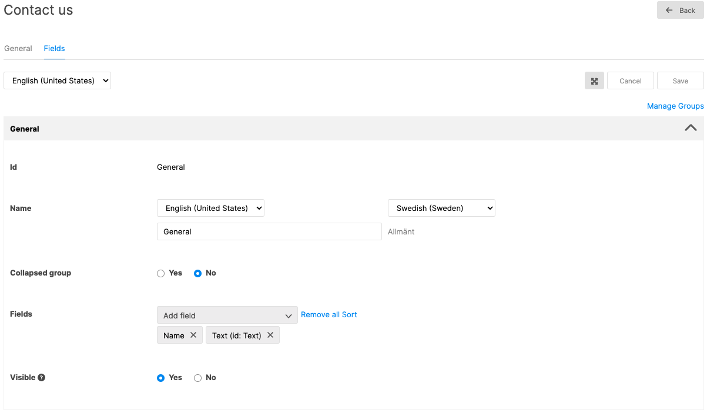
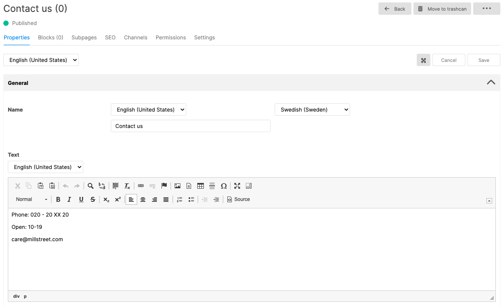

A guide to create and render a new or existing page templates in React accelerator.

React accelerator comes with built-in page templates and page components to render them. They are built based on NextJS's [File conventions](https://beta.nextjs.org/docs/routing/fundamentals#file-conventions) and [routing](https://beta.nextjs.org/docs/routing/defining-routes), with a [Middleware](/accelerators/react/routing-fundamentals) to forward requests to the right template's files. Accelerator comes with a set of [pre-defined page templates](/accelerators/react/working-with-page-types). For each template, we should have a file `/app/{TEMPLATE_ID}{TEMPLATE_TYPE}/[[...slug]]/page.tsx` to handle requests. Where `{TEMPLATE_ID}` should be replaced by the Id of the template, and `{TEMPLATE_TYPE}` is its type. For example:

1.  Page templates: `/app/HomePage/[[...slug]]/page.tsx` for _Home_ page template.
2.  Category template: `/app/CategoryProductCategory/[[...slug]]/page.tsx` for _CategoryProduct_ category template.
3.  Product template: `/app/ProductWithVariantsListProduct/[[...slug]]/page.tsx` for _ProductWithVariantsList_ product template.

Wondering about \[\[...slug\]\]? It is called [Option catch-all segment](https://beta.nextjs.org/docs/routing/defining-routes#optional-catch-all-segments).

In this article, we will create a new Page template and create a component to render its content.

## Create a Contact us page template

The field templates for the **Websites** area can be found in backoffice, **Settings** > **Websites** > **Field templates**. Clicking on the **New** button should open a dialog to add new field template. Fill in _Page_ for **Type**, and _ContactUs_ for **Id**. Note this Id value as we need it later to create a folder for page.tsx file.

Switching to **Fields** tab, we should add a Field to this template so we can get its data and render it. Let's try with a simple **Text** field, whose **Id** is _Text_.



## Create a Contact us page

[Create a new page](https://docs.litium.com/help/litium-8/websites-cms/pages/create-a-page) under Home page, where its name is _Contact us_ and its page template is the ContactUs template we recently created. Fill in the text and publish the page.



## Create page component

Following the folder name convention above, we should have a file _app/ContactUsPage/[[...slug]]/page.tsx_ where its content should be:

```tsx
import { gql } from '@apollo/client';
import { Metadata } from 'next';
import { queryServer } from 'services/dataService.server';
import { createMetadataFromUrl } from 'services/metadataService.server';

export default async function Page({ params }: { params: any }) {
  const content = await getContent({ params });
  return <div dangerouslySetInnerHTML={{ __html: content.fields.text }}></div>;
}

async function getContent({ params }: { params: any }) {
  return (
    await queryServer({
      query: GET_CONTENT,
      url: params.slug?.join('/') ?? '/'
    })
  ).content;
}

const GET_CONTENT = gql`
  query GetContent {
    content {
      ... on ContactUsPage {
        fields {
          text
        }
      }
    }
  }
`;

export async function generateMetadata({
  params,
}: {
  params: any;
}): Promise<Metadata> {
  return await createMetadataFromUrl(params.slug?.join('/'));
}
```

What the code above does is:

- Fetches the _Text_ field data by invoking the _getContent_ function, which sends a GraphQL query to the server.
- Renders the _Text_ field as raw HTML. For more info regarding [dangerously settings the inner HTML](https://react.dev/reference/react-dom/components/common#dangerously-setting-the-inner-html).
- Generates and returns [Metadata](https://beta.nextjs.org/docs/api-reference/metadata).

Now, assuming we have created a Contact us page with _/contact-us_ as the Url, opening https://localhost:3001/contact-us should render the page.

## Related

- [How to create blocks in the React accelerator](/platform/guides/how-to-create-blocks-in-react-accelerator)
