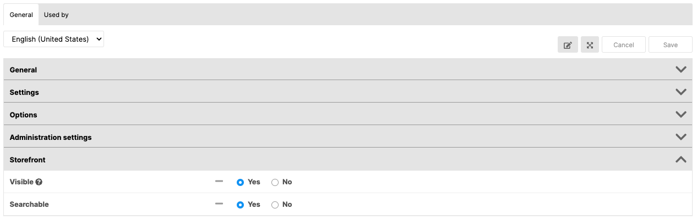
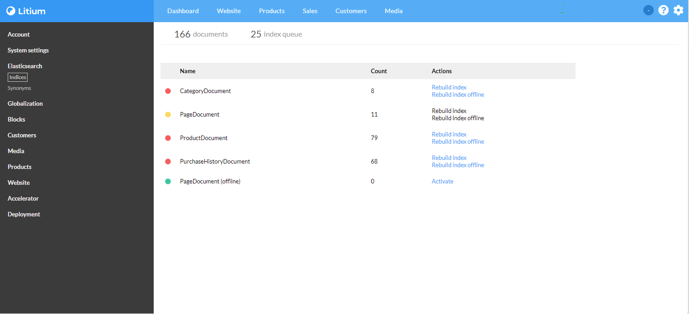

You can select what fields should be searchable by users in a storefront or portal.

Note that if you are using the Litium MVC Accelerator, jump down to the section for this further down in this page.

## Set fields to be indexed and searchable

When editing a field definitiotn, you can set the field to be searchable. The default setting is that it is searchable.

## Build and rebuild indices

After [setup](/platform/guides/litiumsearch-set-up-litium-search) and [configuration](/platform/guides/litiumsearch-configure-litium-search), build the indices and the search function should work for your site.

Click the Litium search node in Settings. 

  

From Litium 8.5 the search indices have been made smarter and automatically detect if a schema inside Litium Search is outdated to what the code expects. Outdated schemas are indicated in the list of document types with the green, yellow, or red indication in front of each row.

Status indications

- Green = Schema is matching
- Yellow = Index is in offline rebuilding mode
- Red = Schema need to be updated

An index can either be rebuilt online, which is the default, or offline. The difference between online and offline is that the offline rebuilding is recreating the schema and processing the indexing queue in background without interference with searches made from the public site for pages, products and categories.

When an offline index rebuild has been completed the index is automatically taken online. If you want to bring the index online even before the indexing have been completed the _bring online_ action can be used.

In versions previous to 8.5 the offline rebuild is not possible and when the schema is outdated the search index prefix needs to manually be changed with an online rebuild.

## MVC Accelerator

If Elasticsearch is configured in the project then _Accelerator/Search indexing_ node will be displayed in Settings.

You can select the fields that should be indexed.

If you don't select any fields in a template, all fields will be indexed.

  

